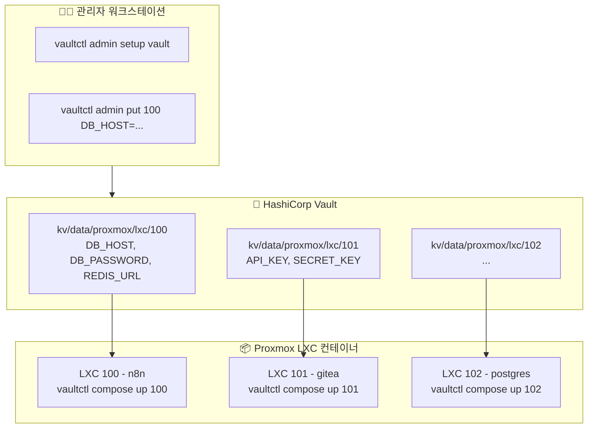
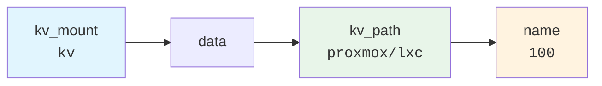
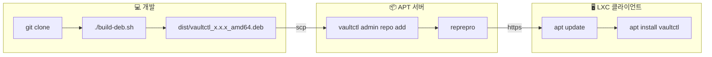

# vaultctl

[English](README.md) | **한국어**

LXC 환경을 위한 간단한 Vault CLI.

Proxmox LXC 컨테이너의 시크릿을 HashiCorp Vault로 중앙 관리하는 CLI 도구입니다.

## 목차

- [특징](#특징)
- [아키텍처](#아키텍처)
- [설치 방법](#설치-방법)
- [빠른 시작](#빠른-시작)
- [명령어 레퍼런스](#명령어-레퍼런스)
  - [사용자 명령어](#사용자-명령어)
  - [관리자 명령어](#관리자-명령어)
- [Docker Compose 통합](#docker-compose-통합)
- [확장 명령어](#확장-명령어-teller-스타일)
- [설정](#설정)
- [APT 서버 구축](#apt-서버-구축)
- [패키지 빌드 및 배포](#패키지-빌드-및-배포)
- [보안 참고사항](#보안-참고사항)
- [문제 해결](#문제-해결)

---

## 특징

- 🔐 **간단한 설정**: `vaultctl init` 한 번으로 초기 설정 완료
- 📦 **시크릿 관리**: LXC별 환경변수 중앙 관리
- 🐳 **Docker Compose**: .env.secrets 자동 생성 및 compose 파일 업데이트 통합
- 🔄 **토큰 자동 갱신**: AppRole 토큰 만료 시 자동 재발급
- 🎯 **단일 바이너리**: Python 의존성 없이 설치 (deb 패키지)
- 🚀 **프로세스 실행**: 환경변수 주입하며 명령어 실행
- 🔎 **비밀 스캔**: 코드에서 하드코딩된 비밀 검색 (DevSecOps)
- 👁️ **변경 감지**: Vault 비밀 변경 시 자동 재시작

---

## 아키텍처



### KV 경로 구조



**전체 경로 예시:** `kv/data/proxmox/lxc/100`

---

## 설치 방법

### 옵션 1: GitHub에서 바로 설치 (권장)

```bash
curl -fsSL https://raw.githubusercontent.com/meloncafe/vaultctl/main/scripts/install.sh | sudo bash
```

### 옵션 2: 개인 APT 서버에서 설치

```bash
# 클라이언트 설정 (최초 1회)
curl -fsSL https://apt.example.com/setup-client.sh | sudo bash -s -- apt "password"

# 설치
sudo apt update
sudo apt install vaultctl
```

### 옵션 3: 소스에서 빌드

```bash
git clone https://github.com/YOUR_USERNAME/vaultctl.git
cd vaultctl
poetry install
poetry run vaultctl --help
```

---

## 빠른 시작

### 관리자

#### 1. Vault 설정 (최초 1회)

```bash
vaultctl admin setup vault
```

생성되는 것:
- Policy: `vaultctl` (kv/<path>/*에 read/write)
- AppRole: `vaultctl` (Role ID, Secret ID 발급)

입력 항목:
- Vault 서버 주소
- Root/Admin 토큰
- KV 엔진 마운트 (기본: `kv`)
- 시크릿 베이스 경로 (기본: `proxmox/lxc`)

#### 2. 시크릿 등록

```bash
# LXC 100용 시크릿 추가
vaultctl admin put 100 \
  DB_HOST=postgres.internal \
  DB_PASSWORD=supersecret \
  REDIS_URL=redis://redis.internal:6379

# 전체 목록
vaultctl admin list

# 특정 시크릿 조회
vaultctl admin get 100
```

### 사용자 (각 LXC에서)

#### 1. 초기 설정 (최초 1회)

```bash
vaultctl init
```

대화형으로 입력:
- Vault 서버 주소
- KV 엔진 마운트 (예: `kv`)
- 시크릿 경로 (예: `proxmox/lxc`)
- Role ID (관리자에게 받음)
- Secret ID (관리자에게 받음)

설정은 `~/.config/vaultctl/config`에 저장됩니다.

#### 2. .env 생성 및 실행

```bash
cd /opt/myapp

# .env 파일 생성
vaultctl env 100

# Docker Compose 실행
docker compose up -d
```

또는 `vaultctl run`으로 직접 주입:

```bash
vaultctl run 100 -- docker compose up -d
```

---

## 명령어 레퍼런스

### 사용자 명령어

LXC 컨테이너에서 일상적으로 사용하는 명령어입니다.

| 명령어 | 설명 |
|--------|------|
| `vaultctl init` | 초기 설정 (최초 1회) |
| `vaultctl env <n>` | .env 파일 생성 |
| `vaultctl status` | 연결 및 인증 상태 확인 |
| `vaultctl config` | 현재 설정 출력 |
| `vaultctl run <n> -- cmd` | 환경변수 주입하여 명령 실행 |
| `vaultctl sh <n>` | 셸 export 문 생성 |
| `vaultctl watch <n> -- cmd` | 비밀 변경 시 자동 재시작 |
| `vaultctl scan` | 코드에서 하드코딩된 비밀 검색 |
| `vaultctl redact` | 로그에서 비밀 마스킹 |
| `vaultctl compose init <n>` | Docker Compose + 시크릿 설정 |
| `vaultctl compose up <n>` | 시크릿 동기화 & 컨테이너 시작 |
| `vaultctl compose restart <n>` | 동기화 & 컨테이너 재시작 |

#### vaultctl init

```bash
$ vaultctl init

🔐 Setup
╭──────────────────────────────────────╮
│ vaultctl Initial Setup               │
│                                       │
│ Configure Vault connection and       │
│ authentication.                       │
│ This setup only needs to be done once.│
╰──────────────────────────────────────╯

Vault server address: https://vault.example.com
✓ Connection successful

KV Secret Path
KV engine mount [kv]: kv
Secret path [proxmox/lxc]: proxmox/lxc

AppRole Authentication
Role ID: xxxxxxxx-xxxx-xxxx-xxxx-xxxxxxxxxxxx
Secret ID: ********

✓ Authentication successful
  Policies: vaultctl, default
  TTL: 1 hour

✓ Configuration saved: ~/.config/vaultctl/
```

#### vaultctl env

```bash
# 현재 디렉토리에 .env 생성
vaultctl env 100

# 다른 경로에 저장
vaultctl env 100 -o /opt/myapp/.env

# stdout으로 출력
vaultctl env 100 --stdout
```

#### vaultctl status

```bash
$ vaultctl status

vaultctl Status

1. Configuration
   Vault: https://vault.example.com
   KV Mount: kv
   KV Path: proxmox/lxc/
   Config Dir: ✓ ~/.config/vaultctl

2. Connection
   ✓ Vault server connected

3. Authentication
   ✓ Authenticated
   Policies: vaultctl, default
   TTL: 58 minutes

4. Secrets Access
   ✓ Access to kv/proxmox/lxc/ (5 secrets)

✓ All checks passed
```

### 관리자 명령어

시크릿 및 인프라를 관리하는 관리자용 명령어입니다.

| 명령어 | 설명 |
|--------|------|
| `vaultctl admin list` | 시크릿 목록 |
| `vaultctl admin get <n>` | 시크릿 상세 조회 |
| `vaultctl admin put <n> K=V...` | 시크릿 저장 |
| `vaultctl admin delete <n>` | 시크릿 삭제 |
| `vaultctl admin import <file>` | JSON에서 일괄 가져오기 |
| `vaultctl admin export` | JSON으로 내보내기 |
| `vaultctl admin setup vault` | Vault policy, AppRole 생성 |
| `vaultctl admin setup apt-server` | APT 저장소 서버 구축 |
| `vaultctl admin setup apt-client` | APT 클라이언트 설정 |
| `vaultctl admin repo add <pkg>` | APT 저장소에 패키지 추가 |
| `vaultctl admin repo list` | 패키지 목록 |
| `vaultctl admin repo remove <pkg>` | 패키지 제거 |
| `vaultctl admin token status` | 토큰 상태 확인 |
| `vaultctl admin token renew` | 토큰 갱신 |

#### 시크릿 관리

```bash
# 목록 조회
vaultctl admin list
vaultctl admin list -v  # 상세

# 특정 시크릿 조회
vaultctl admin get 100
vaultctl admin get 100 -f DB_PASSWORD       # 특정 필드만
vaultctl admin get 100 -f DB_PASSWORD -c    # 클립보드 복사
vaultctl admin get 100 --raw                # JSON 출력

# 시크릿 저장
vaultctl admin put 100 DB_HOST=localhost DB_PASSWORD=secret
vaultctl admin put 100 NEW_KEY=value --merge    # 기존 값과 병합
vaultctl admin put 100 ONLY_THIS=value --replace  # 전체 교체

# 삭제
vaultctl admin delete 100
vaultctl admin delete 100 --force  # 확인 없이
```

#### 일괄 작업

```bash
# JSON으로 내보내기
vaultctl admin export -o secrets.json

# JSON에서 가져오기
vaultctl admin import secrets.json
vaultctl admin import secrets.json --dry-run  # 검증만
```

JSON 형식:
```json
{
  "100": {
    "DB_HOST": "postgres.internal",
    "DB_PASSWORD": "secret123"
  },
  "101": {
    "API_KEY": "xxxx",
    "SECRET_KEY": "yyyy"
  }
}
```

#### Vault 설정

```bash
$ vaultctl admin setup vault

Vault server address: https://vault.example.com
Root/Admin token: ********

Testing connection...
✓ Connected

KV Path Configuration
KV engine mount [kv]: kv
Secret base path [proxmox/lxc]: proxmox/lxc

🔐 Vault Setup
╭──────────────────────────────────────╮
│ This will create:                    │
│ • Policy: vaultctl                   │
│ • AppRole: vaultctl                  │
│ • Access: kv/data/proxmox/*          │
╰──────────────────────────────────────╯

1. KV Secrets Engine
   ✓ Exists: kv/

2. Policy
   ✓ Created: vaultctl
   Access: kv/data/proxmox/*

3. AppRole Auth
   ✓ Enabled: approle/

4. AppRole
   ✓ Created: vaultctl

5. Credentials
────────────────────────────────────────
Save these credentials securely!
────────────────────────────────────────
  Role ID:    xxxxxxxx-xxxx-xxxx-xxxx-xxxxxxxxxxxx
  Secret ID:  yyyyyyyy-yyyy-yyyy-yyyy-yyyyyyyyyyyy

  KV Mount:   kv
  KV Path:    proxmox/lxc
────────────────────────────────────────
```

---

## Docker Compose 통합

Vault 시크릿과 Docker Compose 워크플로우의 원활한 통합.

### 빠른 설정

```bash
# docker-compose 프로젝트 디렉토리로 이동
cd /opt/myapp

# 초기화 (.env.secrets 생성, docker-compose.yml 업데이트)
vaultctl compose init 100

# 시크릿과 함께 컨테이너 시작
vaultctl compose up 100
```

### 명령어

| 명령어 | 설명 |
|--------|------|
| `vaultctl compose init <n>` | compose + 시크릿 설정 |
| `vaultctl compose up <n>` | 시크릿 동기화 & 시작 |
| `vaultctl compose down` | 컨테이너 중지 |
| `vaultctl compose restart <n>` | 동기화 & 재시작 |
| `vaultctl compose pull` | 이미지 풀 |
| `vaultctl compose logs` | 로그 출력 |
| `vaultctl compose status` | 상태 확인 |
| `vaultctl compose prune` | 이미지 정리 |
| `vaultctl compose sync <n>` | 시크릿만 동기화 |

### vaultctl compose init

대화형 설정으로:
1. Vault에서 `.env.secrets` 생성
2. `docker-compose.yml`에 `env_file` 항목 추가
3. 관리 스크립트(`ctl.sh`) 생성 (선택)
4. `.gitignore` 업데이트

```bash
# 대화형 모드
vaultctl compose init

# 시크릿 이름 지정
vaultctl compose init 100

# 특정 서비스만
vaultctl compose init 100 -s web,api

# 관리 스크립트 생성
vaultctl compose init 100 --script

# 확인 생략
vaultctl compose init 100 -y
```

**변경 전:**
```yaml
services:
  n8n:
    image: n8nio/n8n
    environment:
      - NODE_ENV=production
```

**변경 후:**
```yaml
services:
  n8n:
    image: n8nio/n8n
    env_file:
      - .env
      - .env.secrets
    environment:
      - NODE_ENV=production
```

### vaultctl compose up

시크릿 동기화 후 컨테이너 시작.

```bash
# 기본 사용
vaultctl compose up 100

# 이미지 먼저 풀
vaultctl compose up 100 --pull

# 빌드 및 오래된 이미지 정리
vaultctl compose up 100 --build --prune

# compose 파일 지정
vaultctl compose up 100 -f docker-compose.prod.yml
```

### vaultctl compose restart

시크릿 동기화 후 컨테이너 재시작 (환경변수 적용을 위해 down + up 실행).

```bash
vaultctl compose restart 100
vaultctl compose restart 100 --pull  # 이미지 먼저 풀
```

### vaultctl compose status

컨테이너 상태 및 시크릿 동기화 상태 확인.

```bash
# 기본 상태
vaultctl compose status

# 동기화 상태 포함
vaultctl compose status 100
```

### 생성된 관리 스크립트

`--script` 옵션으로 `ctl.sh` 생성:

```bash
./ctl.sh up       # 시크릿 동기화 후 시작
./ctl.sh down     # 컨테이너 중지
./ctl.sh restart  # 동기화 후 재시작
./ctl.sh logs -f  # 로그 확인
./ctl.sh pull     # 이미지 풀
./ctl.sh status   # 상태 확인
./ctl.sh sync     # 시크릿만 동기화
./ctl.sh prune    # 이미지 정리
```

### 워크플로우 예시

```bash
# 1. 초기 설정 (최초 1회)
cd /opt/myapp
vaultctl compose init 100 --script

# 2. 일상 사용
./ctl.sh up
./ctl.sh logs -f
./ctl.sh restart

# 3. 시크릿 업데이트 (Vault에서)
vaultctl admin put 100 NEW_API_KEY=xxx

# 4. 새 시크릿 적용
vaultctl compose restart 100
# 또는: ./ctl.sh restart
```

---

## 확장 명령어 (teller 스타일)

[teller](https://github.com/tellerops/teller)에서 영감받은 고급 기능입니다.

### vaultctl run

Vault 환경변수를 주입하며 프로세스를 실행합니다.

```bash
# 환경변수 주입 실행
vaultctl run 100 -- node index.js
vaultctl run 100 -- docker compose up -d

# 셸 명령 실행
vaultctl run 100 --shell -- 'echo $DB_PASSWORD | base64'

# 기존 환경변수 초기화 (격리 실행)
vaultctl run 100 --reset -- python app.py
```

### vaultctl sh

직접 소싱할 수 있는 셸 export 문을 생성합니다.

```bash
# 현재 셸에 환경변수 로드
eval "$(vaultctl sh 100)"

# .bashrc/.zshrc에 추가
echo 'eval "$(vaultctl sh 100)"' >> ~/.bashrc

# Fish 셸
vaultctl sh 100 --format fish | source
```

### vaultctl scan

코드에서 하드코딩된 비밀을 검색합니다 (DevSecOps).

```bash
# 현재 디렉토리 스캔
vaultctl scan

# 특정 경로 스캔
vaultctl scan ./src

# CI/CD용 (발견 시 exit 1)
vaultctl scan --error-if-found

# JSON 출력
vaultctl scan --json

# 특정 시크릿만 검색
vaultctl scan --name 100
```

### vaultctl redact

로그나 출력에서 비밀을 마스킹합니다.

```bash
# 파이프로 전달
cat app.log | vaultctl redact

# 실시간 로그 마스킹
tail -f /var/log/app.log | vaultctl redact

# 파일 처리
vaultctl redact --in dirty.log --out clean.log

# 커스텀 마스크
vaultctl redact --mask "[HIDDEN]" < input.log
```

### vaultctl watch

Vault 비밀 변경 시 프로세스를 자동 재시작합니다.

```bash
# 변경 감지 및 재시작
vaultctl watch 100 -- docker compose up -d

# 체크 간격 설정 (기본 60초)
vaultctl watch 100 --interval 300 -- docker compose up -d

# 재시작 대신 SIGHUP 전송
vaultctl watch 100 --on-change reload -- ./app
```

systemd 서비스 등록:

```ini
# /etc/systemd/system/myapp-watcher.service
[Unit]
Description=MyApp Secret Watcher
After=network.target

[Service]
Type=simple
ExecStart=/usr/bin/vaultctl watch 100 -- docker compose -f /opt/myapp/docker-compose.yml up
Restart=always
WorkingDirectory=/opt/myapp

[Install]
WantedBy=multi-user.target
```

---

## 설정

### 설정 파일

| 경로 | 설명 |
|------|------|
| `~/.config/vaultctl/config` | 사용자 설정 |
| `~/.cache/vaultctl/token` | 캐시된 토큰 |
| `/etc/vaultctl/config` | 시스템 설정 (관리자) |

### 설정 형식

```bash
# ~/.config/vaultctl/config
VAULT_ADDR=https://vault.example.com
VAULT_KV_MOUNT=kv
VAULT_KV_PATH=proxmox/lxc
VAULT_ROLE_ID=xxxxxxxx-xxxx-xxxx-xxxx-xxxxxxxxxxxx
VAULT_SECRET_ID=yyyyyyyy-yyyy-yyyy-yyyy-yyyyyyyyyyyy
```

### 환경변수

| 변수 | 기본값 | 설명 |
|------|--------|------|
| `VAULTCTL_VAULT_ADDR` | `https://vault.example.com` | Vault 서버 주소 |
| `VAULTCTL_VAULT_TOKEN` | - | Vault 토큰 (선택) |
| `VAULTCTL_APPROLE_ROLE_ID` | - | AppRole Role ID |
| `VAULTCTL_APPROLE_SECRET_ID` | - | AppRole Secret ID |
| `VAULTCTL_KV_MOUNT` | `kv` | KV 엔진 마운트 경로 |
| `VAULTCTL_KV_PATH` | `proxmox/lxc` | 시크릿 베이스 경로 |

### KV 경로 예시

| 용도 | kv_mount | kv_path | 전체 경로 |
|------|----------|---------|-----------|
| Proxmox LXC | `kv` | `proxmox/lxc` | `kv/data/proxmox/lxc/100` |
| Docker Swarm | `secrets` | `docker/swarm` | `secrets/data/docker/swarm/myapp` |
| Kubernetes | `kv` | `k8s/prod` | `kv/data/k8s/prod/deployment` |

---

## APT 서버 구축

### APT 서버 설치

```bash
sudo vaultctl admin setup apt-server
```

대화형 설정:
- 웹 서버 모드 (Caddy/Traefik)
- 도메인 설정
- GPG 서명
- 인증

### APT 클라이언트 설정

```bash
sudo vaultctl admin setup apt-client https://apt.example.com -u apt -p "password"
```

### 패키지 관리

```bash
# 패키지 추가
vaultctl admin repo add vaultctl_0.1.0_amd64.deb

# 패키지 목록
vaultctl admin repo list

# 패키지 제거
vaultctl admin repo remove vaultctl

# GitHub 릴리스에서 동기화
vaultctl admin repo sync
```

---

## 패키지 빌드 및 배포



### 빌드

```bash
git clone https://github.com/YOUR_USERNAME/vaultctl.git
cd vaultctl
./build-deb.sh
# 결과: dist/vaultctl_x.x.x_amd64.deb
```

### 배포

```bash
# APT 서버로 복사
scp dist/vaultctl_*.deb root@apt-server:/tmp/

# 저장소에 추가
ssh root@apt-server "vaultctl admin repo add /tmp/vaultctl_*.deb"

# 클라이언트 업데이트
sudo apt update && sudo apt upgrade vaultctl
```

---

## 보안 참고사항

### 파일 권한

```bash
# 사용자 설정 (자격 증명 포함)
chmod 600 ~/.config/vaultctl/config

# 토큰 캐시
chmod 600 ~/.cache/vaultctl/token
```

### 토큰 관리

- AppRole 토큰은 만료 시 자동 갱신됩니다
- 캐시된 토큰은 `~/.cache/vaultctl/token`에 저장됩니다
- `vaultctl admin token status`로 토큰 TTL을 확인하세요

---

## 문제 해결

### 인증 오류

```bash
# 상태 확인
vaultctl status

# 재설정
vaultctl init
```

### 권한 거부 (Permission Denied)

Policy 설정을 확인하세요:

```bash
# 현재 설정 확인
vaultctl config

# Policy가 올바른 경로를 허용하는지 확인
# Policy에 다음이 포함되어야 합니다:
#   path "kv/data/proxmox/*" { capabilities = [...] }
#   path "kv/metadata/proxmox/*" { capabilities = [...] }
```

### 연결 문제

```bash
# Vault 연결 테스트
curl -s https://vault.example.com/v1/sys/health | jq

# 설정 확인
vaultctl config
```

### 토큰 만료

```bash
# 토큰 확인
vaultctl admin token status

# 토큰 갱신
vaultctl admin token renew

# 또는 재인증 (AppRole)
vaultctl init
```

---

## 이전 버전에서 마이그레이션

| 이전 명령어 | 새 명령어 |
|-------------|-----------|
| `vaultctl setup init` | `vaultctl init` |
| `vaultctl auth login` | `vaultctl init` |
| `vaultctl auth status` | `vaultctl status` |
| `vaultctl lxc list` | `vaultctl admin list` |
| `vaultctl lxc get <n>` | `vaultctl admin get <n>` |
| `vaultctl lxc put <n>` | `vaultctl admin put <n>` |
| `vaultctl docker env <n>` | `vaultctl env <n>` |
| `vaultctl token renew` | `vaultctl admin token renew` |
| `vaultctl repo add` | `vaultctl admin repo add` |

### 설정 변경

이전 설정 형식:
```bash
VAULT_ADDR=...
VAULT_KV_MOUNT=proxmox    # 마운트로 사용됨
VAULT_KV_PATH=lxc         # 서브 경로
```

새 설정 형식:
```bash
VAULT_ADDR=...
VAULT_KV_MOUNT=kv         # KV 엔진 마운트
VAULT_KV_PATH=proxmox/lxc # KV 내 전체 경로
```

---

## 라이선스

MIT License
