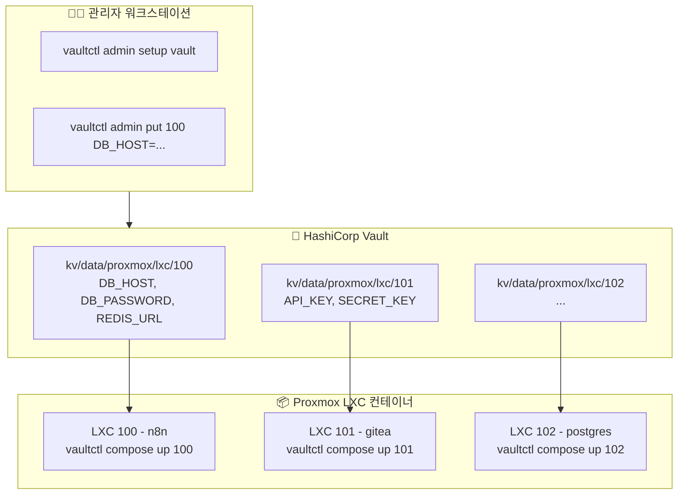
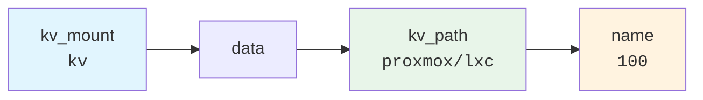
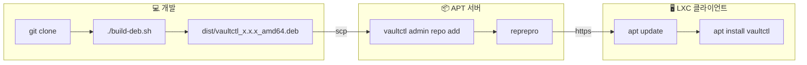

# vaultctl

[English](README.md) | **한국어**

LXC 환경을 위한 간단한 Vault CLI.

Proxmox LXC 컨테이너의 시크릿을 HashiCorp Vault로 중앙 관리하는 CLI 도구입니다.

## 목차

- [특징](#특징)
- [아키텍처](#아키텍처)
- [설치 방법](#설치-방법)
- [빠른 시작](#빠른-시작)
- [명령어 레퍼런스](#명령어-레퍼런스)
- [Docker Compose 통합](#docker-compose-통합)
- [확장 명령어](#확장-명령어-teller-스타일)
- [설정](#설정)
- [APT 서버 구축](#apt-서버-구축)
- [패키지 빌드 및 배포](#패키지-빌드-및-배포)
- [보안 참고사항](#보안-참고사항)
- [문제 해결](#문제-해결)

---

## 특징

- 🔐 **간단한 설정**: `vaultctl init`으로 AppRole 자격 증명 자동 생성
- 📦 **시크릿 관리**: LXC별 환경변수 중앙 관리
- 🐳 **Docker Compose**: .env.secrets 자동 생성 및 compose 파일 업데이트 통합
- 🔄 **토큰 자동 갱신**: AppRole 토큰 만료 시 자동 재발급
- 🎯 **단일 바이너리**: Python 의존성 없이 설치 (deb 패키지)
- 🚀 **프로세스 실행**: 환경변수 주입하며 명령어 실행
- 🔎 **비밀 스캔**: 코드에서 하드코딩된 비밀 검색 (DevSecOps)
- 👁️ **변경 감지**: Vault 비밀 변경 시 자동 재시작

---

## 아키텍처



### KV 경로 구조



**전체 경로 예시:** `kv/data/proxmox/lxc/100`

---

## 설치 방법

### 옵션 1: GitHub에서 바로 설치 (권장)

```bash
curl -fsSL https://raw.githubusercontent.com/meloncafe/vaultctl/main/scripts/install.sh | sudo bash
```

### 옵션 2: 개인 APT 서버에서 설치

```bash
# 클라이언트 설정 (최초 1회)
curl -fsSL https://apt.example.com/setup-client.sh | sudo bash -s -- apt "password"

# 설치
sudo apt update
sudo apt install vaultctl
```

### 옵션 3: 소스에서 빌드

```bash
git clone https://github.com/YOUR_USERNAME/vaultctl.git
cd vaultctl
poetry install
poetry run vaultctl --help
```

---

## 빠른 시작

### 1단계: 관리자 설정 (최초 1회, 아무 머신에서나)

```bash
vaultctl admin setup vault
```

Vault에 Policy와 AppRole을 생성합니다. 입력 항목:
- Vault 서버 주소
- Root/Admin 토큰
- KV 엔진 마운트 (기본: `kv`)
- 시크릿 베이스 경로 (기본: `proxmox/lxc`)

### 2단계: 시크릿 등록

```bash
# LXC 100용 시크릿 추가 (경로 자동 생성)
vaultctl admin put 100 \
  DB_HOST=postgres.internal \
  DB_PASSWORD=supersecret \
  REDIS_URL=redis://redis.internal:6379
```

### 3단계: 각 LXC에서 초기화

```bash
vaultctl init
```

프롬프트에서:
1. Vault 서버 주소 입력
2. Admin 토큰 입력 (Secret ID 자동 생성용)
3. KV 마운트 및 경로 입력
4. AppRole 이름 (기본: `vaultctl`)

**끝!** 이 머신용 Secret ID가 자동 생성됩니다.

### 4단계: 시크릿 사용

```bash
# .env 파일 생성
vaultctl env 100

# 또는 Docker Compose와 함께 사용
vaultctl compose init 100
vaultctl compose up 100
```

---

## 명령어 레퍼런스

### 사용자 명령어

| 명령어 | 설명 |
|--------|------|
| `vaultctl init` | 초기 설정 (Secret ID 자동 생성) |
| `vaultctl env <n>` | .env 파일 생성 |
| `vaultctl status` | 연결 및 인증 상태 확인 |
| `vaultctl config` | 현재 설정 출력 |
| `vaultctl run <n> -- cmd` | 환경변수 주입하여 명령 실행 |
| `vaultctl sh <n>` | 셸 export 문 생성 |
| `vaultctl watch <n> -- cmd` | 비밀 변경 시 자동 재시작 |
| `vaultctl scan` | 코드에서 하드코딩된 비밀 검색 |
| `vaultctl redact` | 로그에서 비밀 마스킹 |

### 관리자 명령어

| 명령어 | 설명 |
|--------|------|
| `vaultctl admin setup vault` | Vault policy, AppRole 생성 |
| `vaultctl admin credentials` | Role ID 조회 + 새 Secret ID 생성 |
| `vaultctl admin list` | 시크릿 목록 |
| `vaultctl admin get <n>` | 시크릿 상세 조회 |
| `vaultctl admin put <n> K=V...` | 시크릿 저장 (경로 자동 생성) |
| `vaultctl admin delete <n>` | 시크릿 삭제 |
| `vaultctl admin import <file>` | JSON에서 일괄 가져오기 |
| `vaultctl admin export` | JSON으로 내보내기 |
| `vaultctl admin token status` | 토큰 상태 확인 |
| `vaultctl admin token renew` | 토큰 갱신 |

### Docker Compose 명령어

| 명령어 | 설명 |
|--------|------|
| `vaultctl compose init <n>` | compose + 시크릿 설정 |
| `vaultctl compose up <n>` | 시크릿 동기화 & 시작 |
| `vaultctl compose down` | 컨테이너 중지 |
| `vaultctl compose restart <n>` | 동기화 & 재시작 |
| `vaultctl compose status` | 상태 확인 |
| `vaultctl compose sync <n>` | 시크릿만 동기화 |

---

## 상세 사용법

### vaultctl init

이 머신용 AppRole 자격 증명을 자동 생성합니다.

```bash
$ vaultctl init

🔐 Setup
╭──────────────────────────────────────────╮
│ vaultctl Initial Setup                   │
│                                          │
│ Vault에 연결하고 AppRole 자격 증명을      │
│ 생성합니다. Admin 토큰이 필요합니다.      │
╰──────────────────────────────────────────╯

Vault server address: https://vault.example.com
✓ Connection successful

Admin Authentication
Admin/Root token: ********
✓ Admin authentication successful

KV Secret Path
KV engine mount [kv]: kv
Secret path [proxmox/lxc]: proxmox/lxc

AppRole
AppRole name [vaultctl]: vaultctl

Checking AppRole 'vaultctl'...
✓ AppRole found: vaultctl
   Policies: vaultctl
✓ Role ID retrieved

Generating Secret ID for lxc-100...
✓ Secret ID generated

Testing AppRole authentication...
✓ AppRole authentication successful
   Policies: vaultctl, default
   TTL: 1 hour

✓ Configuration saved: ~/.config/vaultctl/
```

### vaultctl admin credentials

전체 init 없이 자격 증명 생성 (스크립팅에 유용):

```bash
# 새 LXC용 자격 증명 생성
vaultctl admin credentials

# TTL 설정
vaultctl admin credentials --ttl 7d

# 클립보드에 복사
vaultctl admin credentials --copy-secret
```

### vaultctl admin put

시크릿은 자동으로 저장됩니다 - 경로를 먼저 만들 필요 없음:

```bash
# proxmox/lxc/100 경로 자동 생성
vaultctl admin put 100 DB_HOST=localhost DB_PASSWORD=secret

# 기존 값과 병합 (기본)
vaultctl admin put 100 NEW_KEY=value

# 전체 값 교체
vaultctl admin put 100 ONLY_THIS=value --replace
```

### vaultctl env

```bash
# 현재 디렉토리에 .env 생성
vaultctl env 100

# 다른 경로에 저장
vaultctl env 100 -o /opt/myapp/.env

# stdout으로 출력
vaultctl env 100 --stdout
```

---

## Docker Compose 통합

### 빠른 설정

```bash
cd /opt/myapp
vaultctl compose init 100
vaultctl compose up 100
```

### `compose init`이 하는 일

1. Vault에서 `.env.secrets` 생성
2. `docker-compose.yml`에 `env_file` 항목 추가
3. `ctl.sh` 관리 스크립트 생성 (선택)
4. `.gitignore` 업데이트

**변경 전:**
```yaml
services:
  app:
    image: myapp
```

**변경 후:**
```yaml
services:
  app:
    image: myapp
    env_file:
      - .env
      - .env.secrets
```

### 관리 스크립트

```bash
vaultctl compose init 100 --script

./ctl.sh up       # 시크릿 동기화 후 시작
./ctl.sh restart  # 동기화 후 재시작
./ctl.sh logs -f  # 로그 확인
./ctl.sh status   # 상태 확인
```

---

## 확장 명령어 (teller 스타일)

### vaultctl run

```bash
vaultctl run 100 -- node index.js
vaultctl run 100 -- docker compose up -d
vaultctl run 100 --shell -- 'echo $DB_PASSWORD | base64'
```

### vaultctl sh

```bash
eval "$(vaultctl sh 100)"
```

### vaultctl scan

```bash
vaultctl scan ./src
vaultctl scan --error-if-found  # CI/CD
```

### vaultctl watch

```bash
vaultctl watch 100 -- docker compose up -d
```

---

## 설정

### 파일

| 경로 | 설명 |
|------|------|
| `~/.config/vaultctl/config` | 사용자 설정 |
| `~/.cache/vaultctl/token` | 캐시된 토큰 |

### 형식

```bash
# ~/.config/vaultctl/config
VAULT_ADDR=https://vault.example.com
VAULT_KV_MOUNT=kv
VAULT_KV_PATH=proxmox/lxc
VAULT_ROLE_ID=xxxxxxxx-xxxx-xxxx-xxxx-xxxxxxxxxxxx
VAULT_SECRET_ID=yyyyyyyy-yyyy-yyyy-yyyy-yyyyyyyyyyyy
```

### 환경변수

| 변수 | 기본값 | 설명 |
|------|--------|------|
| `VAULTCTL_VAULT_ADDR` | - | Vault 서버 주소 |
| `VAULTCTL_KV_MOUNT` | `kv` | KV 엔진 마운트 경로 |
| `VAULTCTL_KV_PATH` | `proxmox/lxc` | 시크릿 베이스 경로 |
| `VAULTCTL_APPROLE_ROLE_ID` | - | AppRole Role ID |
| `VAULTCTL_APPROLE_SECRET_ID` | - | AppRole Secret ID |

---

## APT 서버 구축

### APT 서버 설치

```bash
sudo vaultctl admin setup apt-server
```

### 클라이언트 설정

```bash
sudo vaultctl admin setup apt-client https://apt.example.com -u apt -p "password"
```

### 패키지 관리

```bash
vaultctl admin repo add vaultctl_0.1.0_amd64.deb
vaultctl admin repo list
vaultctl admin repo remove vaultctl
```

---

## 패키지 빌드 및 배포



```bash
# 빌드
./build-deb.sh

# 배포
scp dist/vaultctl_*.deb root@apt-server:/tmp/
ssh root@apt-server "vaultctl admin repo add /tmp/vaultctl_*.deb"

# 클라이언트 업데이트
sudo apt update && sudo apt upgrade vaultctl
```

---

## 보안 참고사항

### 파일 권한

```bash
chmod 600 ~/.config/vaultctl/config
chmod 600 ~/.cache/vaultctl/token
```

### 토큰 관리

- AppRole 토큰은 만료 시 자동 갱신됩니다
- 캐시된 토큰은 `~/.cache/vaultctl/token`에 저장됩니다
- `vaultctl admin token status`로 토큰 TTL을 확인하세요

---

## 문제 해결

### 인증 오류

```bash
vaultctl status
vaultctl init  # 재초기화
```

### 권한 거부 (Permission Denied)

```bash
vaultctl config
# Policy에 다음이 포함되어야 함: path "kv/data/proxmox/*" { ... }
```

### 연결 문제

```bash
curl -s https://vault.example.com/v1/sys/health | jq
```

---

## 라이선스

MIT License
