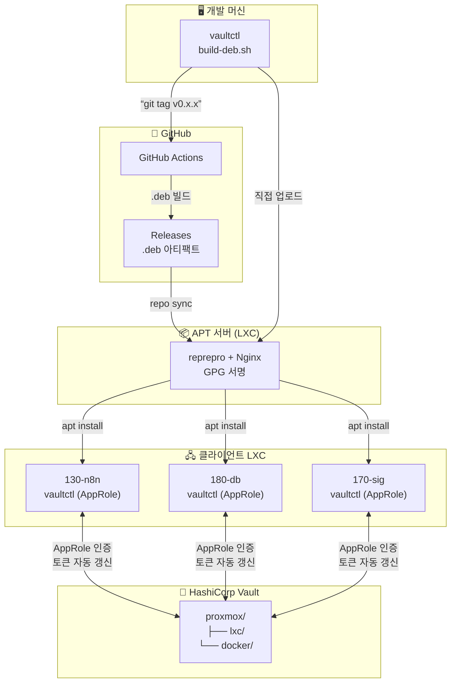
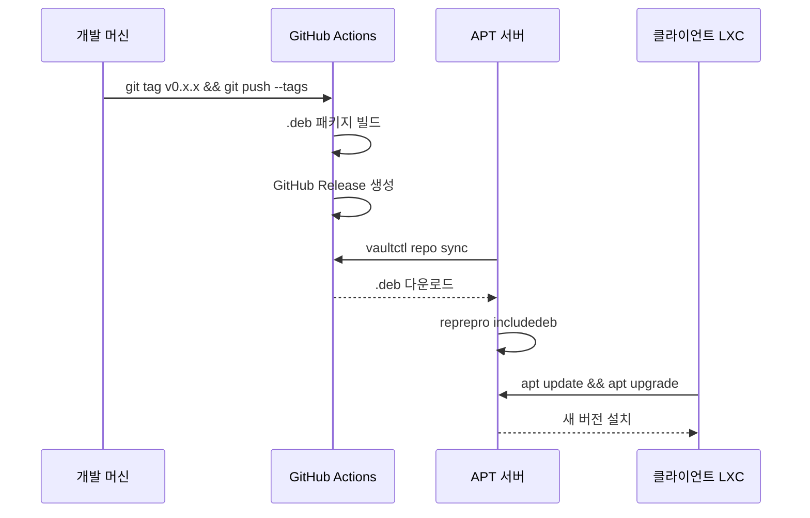

# vaultctl

[English](README.md) | **한국어**

HashiCorp Vault CLI with AppRole authentication.

Proxmox LXC 컨테이너의 비밀번호/URL, Docker 환경변수를 Vault로 중앙 관리하는 CLI 도구입니다.

## 목차

- [특징](#특징)
- [아키텍처](#아키텍처)
- [설치 방법](#설치-방법)
  - [옵션 1: 개인 APT 서버에서 설치](#옵션-1-개인-apt-서버에서-설치-권장)
  - [옵션 2: GitHub에서 직접 설치](#옵션-2-github에서-직접-설치)
  - [옵션 3: 소스에서 빌드](#옵션-3-소스에서-빌드)
- [초기 설정](#초기-설정)
- [명령어 사용법](#명령어-사용법)
- [확장 명령어 (teller 스타일)](#확장-명령어-teller-스타일)
  - [vaultctl run](#vaultctl-run---환경변수-주입-실행)
  - [vaultctl sh](#vaultctl-sh---셸-통합)
  - [vaultctl scan](#vaultctl-scan---비밀-스캔-devsecops)
  - [vaultctl redact](#vaultctl-redact---로그-정리)
  - [vaultctl watch](#vaultctl-watch---비밀-변경-감지)
- [APT 서버 구축](#apt-서버-구축)
  - [GitHub 릴리스 동기화](#github-릴리스-동기화-repo-sync)
- [패키지 빌드 및 배포](#패키지-빌드-및-배포)
- [업데이트 플로우](#업데이트-플로우)
- [보안 참고사항](#보안-참고사항)
- [문제 해결](#문제-해결)
- [teller와의 비교](#teller와의-비교)

---

## 특징

- 🔐 **AppRole 인증**: 토큰 만료 시 자동 재발급 (서버용 권장)
- 📦 **LXC 관리**: 비밀번호, IP, 설정 정보 중앙 관리
- 🐳 **Docker 지원**: .env 파일 자동 생성, docker-compose 연동
- 🔄 **토큰 자동 갱신**: systemd timer로 서버에서 자동화
- 📋 **클립보드 복사**: 비밀번호를 바로 클립보드에
- 🎯 **단일 바이너리**: Python 의존성 없이 설치 (deb 패키지)
- 🚀 **프로세스 실행**: 환경변수 주입하며 명령어 실행 (`vaultctl run`)
- 🔎 **비밀 스캔**: 코드에서 하드코딩된 비밀 검색 (DevSecOps)
- 🛡️ **로그 마스킹**: 출력/로그에서 비밀 자동 리다크션
- 👁️ **변경 감지**: Vault 비밀 변경 시 자동 재시작 (`vaultctl watch`)
- 🔗 **GitHub 릴리스 동기화**: GitHub에서 최신 버전 자동 배포 (`vaultctl repo sync`)

---

## 아키텍처



### 배포 흐름



---

## 설치 방법

### 옵션 1: 개인 APT 서버에서 설치 (권장)

개인 서버에 APT 저장소가 구축되어 있는 경우:

```bash
# 1. 클라이언트 설정 (최초 1회)
curl -fsSL https://apt.example.com/setup-client.sh | sudo bash -s -- apt "비밀번호"

# 2. 설치
sudo apt update
sudo apt install vaultctl

# 3. 업데이트 (새 버전 배포 후)
sudo apt update && sudo apt upgrade vaultctl
```

수동 설정:

```bash
# 1. GPG 키 추가
curl -fsSL -u apt:PASSWORD https://apt.example.com/KEY.gpg | \
    sudo gpg --dearmor -o /usr/share/keyrings/internal-apt.gpg

# 2. 인증 설정 (프라이빗 저장소인 경우)
echo "machine apt.example.com login apt password PASSWORD" | \
    sudo tee /etc/apt/auth.conf.d/internal.conf
sudo chmod 600 /etc/apt/auth.conf.d/internal.conf

# 3. APT 소스 추가
echo "deb [signed-by=/usr/share/keyrings/internal-apt.gpg] https://apt.example.com stable main" | \
    sudo tee /etc/apt/sources.list.d/internal.list

# 4. 설치
sudo apt update
sudo apt install vaultctl
```

### 옵션 2: GitHub에서 직접 설치

```bash
# 최신 릴리스 다운로드
wget https://github.com/YOUR_USERNAME/vaultctl/releases/latest/download/vaultctl_0.1.0_amd64.deb

# 설치
sudo apt install ./vaultctl_0.1.0_amd64.deb
```

### 옵션 3: 소스에서 빌드

```bash
# 저장소 클론
git clone https://github.com/YOUR_USERNAME/vaultctl.git
cd vaultctl

# Poetry로 개발 환경 설정
poetry install

# 실행
poetry run vaultctl --help

# 또는 deb 패키지 빌드
./build-deb.sh
sudo apt install ./dist/vaultctl_*.deb
```

---

## 초기 설정

### 사전 준비: Vault AppRole 설정 (관리자)

vaultctl은 **AppRole 인증**을 권장합니다. 토큰이 만료되어도 자동으로 재발급됩니다.

#### 1. Vault Policy 생성

```bash
# Vault 서버에서 실행
cat > vaultctl-policy.hcl << 'EOF'
# KV v2 시크릿 엔진 읽기/쓰기
path "proxmox/data/*" {
  capabilities = ["create", "read", "update", "delete", "list"]
}

path "proxmox/metadata/*" {
  capabilities = ["list", "read", "delete"]
}

# 토큰 자체 정보 조회 및 갱신
path "auth/token/lookup-self" {
  capabilities = ["read"]
}

path "auth/token/renew-self" {
  capabilities = ["update"]
}
EOF

vault policy write vaultctl vaultctl-policy.hcl
```

> **참고**: `proxmox`는 KV 엔진 마운트 경로입니다. 환경에 맞게 변경하세요.

#### 2. AppRole 활성화 및 Role 생성

```bash
# AppRole 인증 활성화 (최초 1회)
vault auth enable approle

# vaultctl용 Role 생성
vault write auth/approle/role/vaultctl \
  token_policies="vaultctl" \
  token_ttl=1h \
  token_max_ttl=4h \
  secret_id_ttl=0 \
  secret_id_num_uses=0
```

| 설정 | 값 | 설명 |
|------|-----|------|
| `token_ttl` | 1h | 발급된 토큰의 기본 TTL |
| `token_max_ttl` | 4h | 토큰 최대 TTL |
| `secret_id_ttl` | 0 | Secret ID 만료 없음 |
| `secret_id_num_uses` | 0 | Secret ID 사용 횟수 제한 없음 |

#### 3. Role ID와 Secret ID 발급

```bash
# Role ID 조회 (서버별로 동일하게 사용 가능)
vault read auth/approle/role/vaultctl/role-id
# 예: role_id = "xxxx-xxxx-xxxx"

# Secret ID 생성 (서버별로 다르게 발급 권장)
vault write -f auth/approle/role/vaultctl/secret-id
# 예: secret_id = "yyyy-yyyy-yyyy"
```

> **보안 팁**: Secret ID는 서버별로 다르게 발급하면, 특정 서버의 인증만 취소할 수 있습니다.

---

### 방법 1: 설정 마법사 (권장)

```bash
sudo vaultctl setup init
```

대화형으로 다음을 설정합니다:
- Vault 서버 주소
- 인증 방법 선택 (AppRole 권장)
- Role ID / Secret ID 입력
- systemd 자동 갱신 타이머

### 방법 2: 수동 설정

```bash
# 1. 환경 파일 생성
sudo cp /etc/vaultctl/config.example /etc/vaultctl/config
sudo chmod 600 /etc/vaultctl/config

# 2. 설정 편집
sudo nano /etc/vaultctl/config
```

**AppRole 인증** (`/etc/vaultctl/config`):

```bash
# Vault 서버 주소
VAULT_ADDR=https://vault.example.com
VAULTCTL_VAULT_ADDR=https://vault.example.com

# AppRole 인증 (토큰 만료 시 자동 재발급)
VAULTCTL_APPROLE_ROLE_ID=xxxx-xxxx-xxxx
VAULTCTL_APPROLE_SECRET_ID=yyyy-yyyy-yyyy

# 토큰 갱신 설정 (선택)
VAULTCTL_TOKEN_RENEW_THRESHOLD=3600    # TTL이 1시간 미만이면 갱신
VAULTCTL_TOKEN_RENEW_INCREMENT=86400   # 24시간 연장
```

**토큰 직접 입력** (비권장, 토큰 만료 시 수동 갱신 필요):

```bash
# Vault 서버 주소
VAULT_ADDR=https://vault.example.com
VAULTCTL_VAULT_ADDR=https://vault.example.com

# Vault 토큰
VAULT_TOKEN=hvs.xxxxxxxxxxxxxxxx

# 토큰 갱신 설정 (선택)
VAULTCTL_TOKEN_RENEW_THRESHOLD=3600    # TTL이 1시간 미만이면 갱신
VAULTCTL_TOKEN_RENEW_INCREMENT=86400   # 24시간 연장
```

```bash
# 3. 토큰 자동 갱신 활성화 (선택)
sudo systemctl enable --now vaultctl-renew.timer

# 4. 설정 테스트
vaultctl setup test
```

### 인증 방법 비교

| 방법 | 토큰 만료 시 | 서버 재시작 후 | 권장 환경 |
|------|-------------|---------------|----------|
| **AppRole** (권장) | 자동 재발급 | 정상 작동 | 서버, LXC, CI/CD |
| Token 직접 입력 | 수동 갱신 필요 | TTL 내 정상 | 데스크탑, 테스트 |

### 환경 변수 전체 목록

| 변수 | 기본값 | 설명 |
|------|--------|------|
| `VAULTCTL_VAULT_ADDR` | `https://vault.example.com` | Vault 서버 주소 |
| `VAULTCTL_VAULT_TOKEN` | - | Vault 토큰 (또는 `VAULT_TOKEN`) |
| `VAULTCTL_APPROLE_ROLE_ID` | - | AppRole Role ID |
| `VAULTCTL_APPROLE_SECRET_ID` | - | AppRole Secret ID |
| `VAULTCTL_APPROLE_MOUNT` | `approle` | AppRole 인증 마운트 경로 |
| `VAULTCTL_KV_MOUNT` | `proxmox` | KV 시크릿 엔진 마운트 경로 |
| `VAULTCTL_KV_LXC_PATH` | `lxc` | LXC 시크릿 경로 |
| `VAULTCTL_KV_DOCKER_PATH` | `docker` | Docker 시크릿 경로 |
| `VAULTCTL_TOKEN_RENEW_THRESHOLD` | `3600` | 갱신 임계값 (초) |
| `VAULTCTL_TOKEN_RENEW_INCREMENT` | `86400` | 갱신 시 연장 시간 (초) |

---

## 명령어 사용법

### 인증 (auth)

```bash
# AppRole 인증 (서버용 권장)
vaultctl auth login --approle

# 토큰 직접 입력
vaultctl auth login --token hvs.xxx

# 인증 상태 및 서버 상태 확인
vaultctl auth status

# 토큰 정보 확인
vaultctl auth whoami

# 로그아웃 (캐시된 토큰 삭제)
vaultctl auth logout
```

### LXC 관리 (lxc)

```bash
# 모든 LXC 목록
vaultctl lxc list
vaultctl lxc list --verbose  # 상세 정보 포함

# 특정 LXC 정보 조회
vaultctl lxc get 130-n8n

# 특정 필드만 조회
vaultctl lxc get 130-n8n --field ip
vaultctl lxc get 130-n8n -f root_password

# 필드 값을 클립보드에 복사
vaultctl lxc get 130-n8n -f root_password --copy

# 비밀번호 클립보드 복사 (단축)
vaultctl lxc pass 130-n8n
# 또는
vaultctl pass 130-n8n

# LXC 정보 저장/업데이트
vaultctl lxc put 130-n8n root_password=newpass123 ip=10.10.10.130
vaultctl lxc put 130-n8n url=https://n8n.example.com notes="N8N 자동화"

# LXC 삭제
vaultctl lxc delete 130-n8n

# JSON 파일에서 일괄 가져오기
vaultctl lxc import lxc-secrets.json
vaultctl lxc import lxc-secrets.json --merge  # 기존 데이터와 병합

# JSON 파일로 내보내기
vaultctl lxc export
vaultctl lxc export --output backup.json
```

`lxc-secrets.json` 형식:

```json
{
  "130-n8n": {
    "root_password": "password123",
    "ip": "10.10.10.130",
    "url": "https://n8n.example.com",
    "notes": "N8N 자동화 서버"
  },
  "180-database": {
    "root_password": "dbpass456",
    "ip": "10.10.10.180",
    "mysql_root": "mysql_root_pass"
  }
}
```

### Docker 환경변수 관리 (docker)

```bash
# Docker 서비스 목록
vaultctl docker list

# 서비스의 환경변수 조회
vaultctl docker get n8n

# 환경변수 저장
vaultctl docker put n8n DB_HOST=10.10.10.180 DB_PASSWORD=secret123

# .env 파일 생성
vaultctl docker env n8n                    # 현재 디렉토리에 .env 생성
vaultctl docker env n8n --output /opt/n8n  # 지정 경로에 생성
vaultctl docker env n8n --stdout           # 표준 출력으로

# 기존 .env 파일을 Vault로 가져오기
vaultctl docker import-env n8n --file .env
vaultctl docker import-env n8n -f .env --merge  # 기존 값과 병합

# docker-compose 실행 (환경변수 자동 로드)
vaultctl docker compose n8n up -d
vaultctl docker compose n8n logs -f
vaultctl docker compose n8n down

# 서비스 삭제
vaultctl docker delete n8n
```

### 토큰 관리 (token)

```bash
# 토큰 상세 정보
vaultctl token info

# 토큰 갱신 필요 여부 확인 (스크립트용)
vaultctl token check
# 종료 코드: 0=갱신 필요, 1=갱신 불필요, 2=에러

# 수동 갱신
vaultctl token renew
vaultctl token renew --increment 172800  # 48시간 연장

# 자동 갱신 (systemd timer용)
vaultctl token auto-renew
vaultctl token auto-renew --quiet  # 로그 최소화

# 새 토큰 생성 (관리자용)
vaultctl token create --policies admin --ttl 720h
vaultctl token create -p readonly -p lxc-read --ttl 0  # 무기한
```

### 설정 관리 (setup)

```bash
# 초기 설정 마법사
sudo vaultctl setup init

# systemd 타이머 관리
vaultctl setup systemd --status   # 상태 확인
sudo vaultctl setup systemd --enable   # 활성화
sudo vaultctl setup systemd --disable  # 비활성화

# 환경 파일 편집
sudo vaultctl setup config --edit

# 연결 테스트
vaultctl setup test
```

### 단축 명령어

```bash
vaultctl login          # = auth login
vaultctl status         # = auth status
vaultctl ls             # = lxc list
vaultctl ls docker      # = docker list
vaultctl get 130-n8n    # = lxc get 130-n8n
vaultctl pass 130-n8n   # = lxc pass 130-n8n
vaultctl env n8n        # = docker env n8n
vaultctl config         # 현재 설정 출력
```

---

## 확장 명령어 (teller 스타일)

[teller](https://github.com/tellerops/teller)에서 영감을 받은 고급 기능들입니다.

### vaultctl run - 환경변수 주입 실행

Vault의 환경변수를 주입하면서 프로세스를 실행합니다.

```bash
# Docker 서비스의 환경변수로 프로세스 실행
vaultctl run n8n -- node index.js
vaultctl run n8n -- docker-compose up -d

# 셸 명령어 실행
vaultctl run n8n --shell -- 'echo $DB_PASSWORD | base64'

# LXC 시크릿 사용
vaultctl run 130-n8n --source lxc -- ./deploy.sh

# 기존 환경변수 초기화 (격리 실행)
vaultctl run n8n --reset -- python app.py
```

### vaultctl sh - 셸 통합

셸에서 직접 환경변수를 로드합니다.

```bash
# 현재 셸에 환경변수 로드
eval "$(vaultctl sh n8n)"

# .zshrc 또는 .bashrc에 추가하여 자동 로드
eval "$(vaultctl sh n8n)"

# Fish 셸용
vaultctl sh n8n --format fish | source
```

### vaultctl scan - 비밀 스캔 (DevSecOps)

코드에서 Vault에 저장된 비밀이 하드코딩되어 있는지 검색합니다.

```bash
# 현재 디렉토리 스캔
vaultctl scan

# 특정 경로 스캔
vaultctl scan ./src

# 특정 서비스의 비밀만 검색
vaultctl scan --service n8n

# CI/CD 파이프라인용 (발견 시 종료 코드 1)
vaultctl scan --error-if-found

# JSON 출력
vaultctl scan --json

# 특정 디렉토리 제외
vaultctl scan --exclude node_modules --exclude .git
```

CI/CD 파이프라인 예시:

```yaml
# .github/workflows/security.yml
jobs:
  secret-scan:
    runs-on: ubuntu-latest
    steps:
      - uses: actions/checkout@v4
      - name: Scan for hardcoded secrets
        run: vaultctl scan --error-if-found
```

### vaultctl redact - 로그 정리

출력이나 로그에서 비밀을 마스킹합니다.

```bash
# stdin에서 비밀 마스킹
cat app.log | vaultctl redact

# 실시간 로그 정리
tail -f /var/log/app.log | vaultctl redact

# 파일 처리
vaultctl redact --in dirty.log --out clean.log

# 특정 서비스의 비밀만 마스킹
cat log.txt | vaultctl redact --service n8n

# 커스텀 마스크 문자열
vaultctl redact --mask "[HIDDEN]" < input.log
```

### vaultctl watch - 비밀 변경 감지

Vault에서 비밀이 변경되면 자동으로 프로세스를 재시작합니다.

```bash
# 비밀 변경 시 자동 재시작
vaultctl watch n8n -- docker-compose up -d

# 체크 간격 설정 (기본 60초)
vaultctl watch n8n --interval 300 -- docker-compose restart

# SIGHUP 전송 (설정 리로드)
vaultctl watch n8n --on-change reload -- ./app

# 명령어만 실행 (프로세스 관리 없이)
vaultctl watch n8n --on-change exec -- ./notify-slack.sh
```

systemd 서비스로 등록:

```bash
cat > /etc/systemd/system/n8n-watcher.service << EOF
[Unit]
Description=N8N Secret Watcher
After=network.target

[Service]
Type=simple
ExecStart=/usr/bin/vaultctl watch n8n -- docker-compose -f /opt/n8n/docker-compose.yml up -d
Restart=always
EnvironmentFile=/etc/vaultctl/config
WorkingDirectory=/opt/n8n

[Install]
WantedBy=multi-user.target
EOF

sudo systemctl daemon-reload
sudo systemctl enable --now n8n-watcher
```

**사용 시나리오:**
- DB 비밀번호 변경 시 자동 재시작
- API 키 로테이션 후 서비스 리로드
- 설정 변경 감지하여 무중단 배포

---

## APT 서버 구축

### 사전 요구사항

- Ubuntu 22.04+ LXC
- 도메인 (예: `apt.internal.example.com`)
- Traefik 또는 리버스 프록시 (HTTPS용, Traefik 모드)

### 대화형 설치 (권장)

vaultctl이 설치된 LXC에서 대화형으로 APT 서버를 구축합니다:

```bash
# APT 서버 설치 (대화형 마법사)
sudo vaultctl setup apt-server
```

대화형으로 다음을 설정합니다:
- **웹서버 모드**: Caddy(독립 실행) 또는 Traefik(백엔드)
- **도메인**: apt.example.com
- **GPG 서명 정보**: 이메일, 키 이름
- **저장소 설정**: 이름, 코드네임, 아키텍처
- **인증**: 사용자/비밀번호 (선택)

```
$ sudo vaultctl setup apt-server

Select web server mode
  1. Caddy - Standalone with automatic HTTPS (Let's Encrypt)
  2. Traefik - Backend for existing Traefik reverse proxy

Choice / 선택 [1]: 2

╭── 📦 APT Server ─────────────────────╮
│ APT Repository Server Setup                    │
│                                                 │
│ Web server: TRAEFIK                             │
│ Full installation                               │
╰─────────────────────────────────────────────────╯

Domain (e.g., apt.example.com): apt.internal.example.com
GPG signing email: apt@example.com
GPG key name [APT Repository Signing Key]: 
Repository name [internal]: 
Distribution codename [stable]: 
Architecture [amd64]: 
Enable authentication? [Y/n]: y
Auth username [apt]: 
Password: 

Configuration Summary
  Domain        apt.internal.example.com
  GPG Email     apt@example.com
  Repository    internal
  Codename      stable
  Web Server    TRAEFIK
  Auth          Enabled
  Username      apt
  Password      ********
  Listen Port   8080

Proceed with this configuration? [Y/n]: 
```

### 재구성 모드

기존 설정을 변경하려면:

```bash
sudo vaultctl setup apt-server --reconfigure
```

### 클라이언트 설정

클라이언트 LXC에서 APT 저장소를 사용하도록 설정:

```bash
# 대화형 설치
sudo vaultctl setup apt-client https://apt.example.com

# 인증 필요 시
sudo vaultctl setup apt-client https://apt.example.com -u apt -p "password"

# 제거
sudo vaultctl setup apt-client https://apt.example.com --remove
```

또는 원라인 스크립트:

```bash
# 인증 저장소
curl -fsSL https://apt.example.com/setup-client.sh | sudo bash -s -- apt "password"

# 공개 저장소
curl -fsSL https://apt.example.com/setup-client.sh | sudo bash
```

### Traefik 설정 예시

Traefik 모드로 설치한 경우, 다음 Traefik 설정을 추가:

```yaml
# /etc/traefik/dynamic/apt-repo.yml
http:
  routers:
    apt-repo:
      rule: "Host(`apt.internal.example.com`)"
      entryPoints:
        - websecure
      tls:
        certResolver: letsencrypt
      service: apt-repo
  
  services:
    apt-repo:
      loadBalancer:
        servers:
          - url: "http://10.10.10.122:8080"  # APT LXC IP:Port
```

### APT 저장소 관리 (repo)

패키지 추가/제거 명령어:

```bash
# 패키지 추가
vaultctl repo add vaultctl_0.1.0_amd64.deb

# 패키지 목록
vaultctl repo list

# 패키지 제거
vaultctl repo remove vaultctl

# 저장소 정보
vaultctl repo info

# 클라이언트 설치 명령어 출력
vaultctl repo export

# 저장소 무결성 확인
vaultctl repo check

# 오래된 파일 정리
vaultctl repo clean
```

### GitHub 릴리스 동기화 (repo sync)

GitHub 릴리스에서 최신 버전을 자동으로 가져와 APT 저장소에 배포합니다.

**사전 요구사항:**
- GitHub CLI (`gh`) 설치 및 인증: `gh auth login`

```bash
# GitHub 저장소 설정 (최초 1회)
vaultctl repo config --github-repo owner/repo
vaultctl repo config -g harmonys-app/vaultctl

# 현재 설정 확인
vaultctl repo config

# 최신 릴리스 확인 및 배포
vaultctl repo sync

# 업데이트 확인만 (배포 안함)
vaultctl repo sync --check

# 강제 배포 (같은 버전이어도)
vaultctl repo sync --force
```

**예시 출력:**
```
$ vaultctl repo sync
Checking GitHub releases...
  Repository: harmonys-app/vaultctl
  Latest release: v0.2.0 (v0.2.0)
  Published: 2025-01-15
  Current version: 0.1.0

Downloading release v0.2.0...
  Downloaded: vaultctl_0.2.0_amd64.deb

Deploying to APT repository...
✓ Successfully deployed vaultctl_0.2.0_amd64.deb

  Clients can update with:
    sudo apt update && sudo apt upgrade vaultctl
```

### 레거시 명령어 (호환성)

이전 스크립트 방식 명령어도 계속 사용 가능:

```bash
apt-repo-add     # -> vaultctl repo add
apt-repo-list    # -> vaultctl repo list
apt-repo-remove  # -> vaultctl repo remove
apt-repo-info    # -> vaultctl repo info
```

### HTTPS 인증서 vs GPG 서명 키

**이 둘은 완전히 다른 목적입니다:**

| 항목 | HTTPS 인증서 | GPG 서명 키 |
|------|-------------|------------|
| **목적** | 통신 암호화 | 패키지 무결성 검증 |
| **발급** | Let's Encrypt (CA) | 자체 생성 |
| **관리** | Traefik/Caddy | reprepro |
| **갱신** | 자동 (90일) | 불필요 (무기한 가능) |

```
[클라이언트] ──HTTPS(Let's Encrypt)──▶ [APT 서버]
                                           │
                                    .deb 다운로드
                                           │
                                           ▼
                                    GPG 서명 검증
                                    (자체 생성 키)
```

---

## 패키지 빌드 및 배포

### 빌드 환경 요구사항

- Python 3.10+
- Poetry
- Ruby + fpm (`gem install fpm`)
- PyInstaller

### 빌드 단계

```bash
# 1. 저장소 클론
git clone https://github.com/YOUR_USERNAME/vaultctl.git
cd vaultctl

# 2. 버전 업데이트 (필요시)
# pyproject.toml과 src/vaultctl/__init__.py의 version 수정

# 3. deb 패키지 빌드
./build-deb.sh

# 결과: dist/vaultctl_0.1.0_amd64.deb
```

### APT 서버에 배포

```bash
# 1. deb 파일을 APT 서버로 복사
scp dist/vaultctl_0.1.0_amd64.deb root@apt-server:/tmp/

# 2. APT 서버에서 패키지 추가
ssh root@apt-server
apt-repo-add /tmp/vaultctl_0.1.0_amd64.deb

# 3. 확인
apt-repo-list
```

### GitHub Releases 배포 (자동)

```bash
# 1. 버전 태그 생성
git tag v0.1.0
git push origin v0.1.0

# 2. GitHub Actions가 자동으로:
#    - deb 패키지 빌드
#    - GitHub Releases에 업로드
#    - GitHub Pages APT 저장소 업데이트 (선택)
```

---

## 업데이트 플로우

### 시나리오 1: 코드 수정 후 전체 배포

```bash
# 개발 머신에서
cd vaultctl

# 1. 코드 수정
vim src/vaultctl/commands/lxc.py

# 2. 버전 업데이트
# pyproject.toml: version = "0.2.0"
# src/vaultctl/__init__.py: __version__ = "0.2.0"

# 3. 빌드
./build-deb.sh

# 4. APT 서버에 배포
scp dist/vaultctl_0.2.0_amd64.deb root@apt-server:/tmp/
ssh root@apt-server "apt-repo-add /tmp/vaultctl_0.2.0_amd64.deb"

# 각 LXC에서
sudo apt update
sudo apt upgrade vaultctl
```

### 시나리오 2: GitHub 릴리스 (자동화)

```bash
# 개발 머신에서
cd vaultctl

# 1. 코드 수정 및 커밋
git add .
git commit -m "feat: 새로운 기능 추가"

# 2. 버전 태그
git tag v0.2.0
git push origin main --tags

# 3. GitHub Actions가 자동으로 빌드 및 배포

# 각 LXC에서 (GitHub Pages APT 사용시)
sudo apt update
sudo apt upgrade vaultctl
```

### 시나리오 3: GitHub 릴리스 동기화 (repo sync)

APT 서버에서 GitHub 릴리스를 자동으로 가져와 배포합니다.

```bash
# APT 서버에서 (최초 1회 설정)
vaultctl repo config -g harmonys-app/vaultctl

# 최신 버전 확인
vaultctl repo sync --check

# 배포
vaultctl repo sync

# 각 LXC에서
sudo apt update
sudo apt upgrade vaultctl
```

**장점:**
- 개발 머신에서 SCP로 파일 복사 불필요
- GitHub Actions로 빌드 후 APT 서버에서 한 명령어로 배포
- 버전 비교로 중복 배포 방지

### 시나리오 4: 긴급 패치

```bash
# APT 서버에서 직접 이전 버전으로 롤백
apt-repo-remove vaultctl
apt-repo-add /backup/vaultctl_0.1.0_amd64.deb

# 각 LXC에서
sudo apt update
sudo apt install --reinstall vaultctl
```

---

## 각 LXC에서 해야 하는 작업

### 최초 설정 (1회)

```bash
# 1. APT 클라이언트 설정
curl -fsSL https://apt.example.com/setup-client.sh | sudo bash -s -- apt "비밀번호"

# 2. vaultctl 설치
sudo apt update
sudo apt install vaultctl

# 3. 초기 설정
sudo vaultctl setup init

# 또는 수동 설정
sudo cp /etc/vaultctl/config.example /etc/vaultctl/config
sudo nano /etc/vaultctl/config  # VAULT_ADDR, 인증 정보 설정
sudo chmod 600 /etc/vaultctl/config

# 4. 토큰 자동 갱신 활성화
sudo systemctl enable --now vaultctl-renew.timer

# 5. 테스트
vaultctl status
vaultctl lxc list
```

### 일상적인 사용

```bash
# 비밀번호 조회
vaultctl pass 130-n8n

# Docker 환경변수로 서비스 실행
cd /opt/n8n
vaultctl docker env n8n
docker-compose up -d

# 또는 한 번에
vaultctl docker compose n8n up -d
```

### 업데이트

```bash
sudo apt update
sudo apt upgrade vaultctl
```

---

## 보안 참고사항

### 토큰 관리

| 환경 | 권장 방식 |
|------|----------|
| 데스크탑 | 토큰 직접 입력, TTL=0 토큰 |
| 서버 (LXC) | `/etc/vaultctl/config`에 AppRole 설정, systemd timer로 자동 갱신 |

```bash
# 서버용 토큰 생성 (관리자)
vault token create -policy=lxc-read -policy=docker-read -ttl=720h

# 또는 vaultctl로
vaultctl token create -p lxc-read -p docker-read --ttl 720h
```

### 파일 권한

```bash
# 설정 파일
sudo chmod 600 /etc/vaultctl/config

# APT 인증 파일
sudo chmod 600 /etc/apt/auth.conf.d/internal.conf
```

### IP 제한 (추가 보안)

Tailscale/WireGuard 네트워크에서만 접근 허용:

```nginx
# APT 서버 Nginx 설정
location / {
    allow 100.64.0.0/10;  # Tailscale
    allow 10.10.10.0/24;  # 내부 네트워크
    deny all;
    
    # ... 기존 설정
}
```

---

## 문제 해결

### 인증 오류

```bash
# 토큰 상태 확인
vaultctl token info

# 토큰 만료 시 (AppRole 사용 시 자동 재발급)
vaultctl auth login --approle
# 또는 수동으로 토큰 업데이트
sudo nano /etc/vaultctl/config
```

### APT 업데이트 실패

```bash
# GPG 키 문제
sudo rm /usr/share/keyrings/internal-apt.gpg
curl -fsSL -u apt:PASS https://apt.example.com/KEY.gpg | \
    sudo gpg --dearmor -o /usr/share/keyrings/internal-apt.gpg

# 인증 문제
cat /etc/apt/auth.conf.d/internal.conf  # 확인
sudo apt update 2>&1 | grep -i auth
```

### systemd 타이머 문제

```bash
# 타이머 상태 확인
systemctl status vaultctl-renew.timer
systemctl list-timers | grep vaultctl

# 수동 실행 테스트
sudo systemctl start vaultctl-renew.service
journalctl -u vaultctl-renew.service -f
```

### Vault 연결 문제

```bash
# 연결 테스트
vaultctl setup test

# 직접 확인
curl -s https://vault.example.com/v1/sys/health | jq

# 환경 변수 확인
vaultctl config
```

---

## 파일 구조

```
vaultctl/
├── src/vaultctl/           # Python 소스 코드
│   ├── cli.py              # 메인 CLI
│   ├── config.py           # 설정 관리
│   ├── vault_client.py     # Vault API 클라이언트
│   ├── utils.py            # 유틸리티
│   ├── templates.py        # Jinja2 템플릿 렌더링
│   ├── templates/          # 설정 파일 템플릿 (.j2)
│   │   ├── config.j2       # vaultctl 설정 템플릿
│   │   └── apt/            # APT 서버 템플릿
│   │       ├── Caddyfile.j2
│   │       ├── nginx.conf.j2
│   │       ├── index.html.j2
│   │       ├── setup-client.sh.j2
│   │       ├── distributions.j2
│   │       ├── options.j2
│   │       ├── gpg-batch.j2
│   │       ├── apt-config.j2
│   │       ├── fancyindex-header.html.j2
│   │       └── fancyindex-footer.html.j2
│   └── commands/           # 서브 명령어
│       ├── auth.py         # 인증 관리
│       ├── lxc.py          # LXC 관리
│       ├── docker.py       # Docker 환경변수
│       ├── token.py        # 토큰 관리
│       ├── setup.py        # 초기 설정 (init, apt-server, apt-client, systemd)
│       ├── repo.py         # APT 저장소 관리 (add, remove, list, sync, config)
│       └── extended.py     # 확장 명령어 (run, sh, scan, redact, watch)
├── packaging/              # deb 패키지 설정
│   ├── etc/
│   │   └── config.example  # vaultctl 설정 예시
│   ├── scripts/            # 패키지 설치/제거 스크립트
│   └── systemd/            # systemd 유닛 파일
│       ├── vaultctl-renew.service
│       └── vaultctl-renew.timer
├── .github/workflows/      # GitHub Actions
│   └── release.yml
├── build-deb.sh           # deb 패키지 빌드
├── vaultctl.spec          # PyInstaller 스펙
├── pyproject.toml         # Poetry 설정
└── README.md
```

---

## 라이선스

MIT License

---

## teller와의 비교

[teller](https://github.com/tellerops/teller)는 유사한 목적의 오픈소스 도구입니다.

| 기능 | teller | vaultctl |
|------|--------|----------|
| **언어** | Rust | Python |
| **프로바이더** | 10+ (Vault, AWS, GCP 등) | Vault 전용 |
| **프로세스 실행** | ✅ `teller run` | ✅ `vaultctl run` |
| **셸 통합** | ✅ `teller sh` | ✅ `vaultctl sh` |
| **비밀 스캔** | ✅ `teller scan` | ✅ `vaultctl scan` |
| **로그 리다크션** | ✅ `teller redact` | ✅ `vaultctl redact` |
| **템플릿 렌더링** | ✅ Tera | ❌ |
| **프로바이더 동기화** | ✅ `teller copy` | ❌ |
| **변경 감지** | ❌ | ✅ `vaultctl watch` |
| **LXC 전용 관리** | ❌ | ✅ |
| **토큰 자동 갱신** | ❌ | ✅ systemd timer |
| **클립보드 복사** | ❌ | ✅ |
| **APT 패키지** | ❌ 바이너리만 | ✅ deb + APT 저장소 |
| **GitHub 릴리스 동기화** | ❌ | ✅ `vaultctl repo sync` |

**언제 teller를 사용?**
- 다중 클라우드 환경 (AWS + GCP + Azure)
- 프로바이더 간 비밀 동기화 필요
- Tera 템플릿 렌더링 필요

**언제 vaultctl을 사용?**
- Proxmox + Vault 단일 환경
- LXC 컨테이너 관리
- 비밀 변경 시 자동 재시작 필요
- APT 저장소 구축 필요
