# vaultctl

**English** | [한국어](README.ko.md)

Simple Vault CLI for LXC environments.

A CLI tool for centrally managing secrets in Proxmox LXC containers with HashiCorp Vault.

## Table of Contents

- [Features](#features)
- [Architecture](#architecture)
- [Installation](#installation)
- [Quick Start](#quick-start)
- [Command Reference](#command-reference)
  - [User Commands](#user-commands)
  - [Admin Commands](#admin-commands)
- [Docker Compose Integration](#docker-compose-integration)
- [Extended Commands](#extended-commands-teller-style)
- [Configuration](#configuration)
- [APT Server Setup](#apt-server-setup)
- [Package Build and Deployment](#package-build-and-deployment)
- [Security Notes](#security-notes)
- [Troubleshooting](#troubleshooting)

---

## Features

- 🔐 **Simple Setup**: Single `vaultctl init` command for initial configuration
- 📦 **Secret Management**: Centralized management of environment variables per LXC
- 🐳 **Docker Compose**: Full integration with automatic .env.secrets and compose file updates
- 🔄 **Auto Token Renewal**: Automatic AppRole token reissue on expiration
- 🎯 **Single Binary**: Install without Python dependencies (deb package)
- 🚀 **Process Execution**: Run commands with injected environment variables
- 🔎 **Secret Scanning**: Search for hardcoded secrets in code (DevSecOps)
- 👁️ **Change Detection**: Auto-restart on Vault secret changes

---

## Architecture

```mermaid
flowchart TB
    subgraph admin["👨‍💻 Admin Workstation"]
        A1[vaultctl admin setup vault]
        A2[vaultctl admin put 100 DB_HOST=...]
    end

    subgraph vault["🔐 HashiCorp Vault"]
        V1["kv/data/proxmox/lxc/100<br/>DB_HOST, DB_PASSWORD, REDIS_URL"]
        V2["kv/data/proxmox/lxc/101<br/>API_KEY, SECRET_KEY"]
        V3["kv/data/proxmox/lxc/102<br/>..."]
    end

    subgraph lxc["📦 Proxmox LXC Containers"]
        L1["LXC 100 - n8n<br/>vaultctl compose up 100"]
        L2["LXC 101 - gitea<br/>vaultctl compose up 101"]
        L3["LXC 102 - postgres<br/>vaultctl compose up 102"]
    end

    admin --> vault
    V1 --> L1
    V2 --> L2
    V3 --> L3
```



### KV Path Structure


**Full Path Example:** `kv/data/proxmox/lxc/100`

---

## Installation

### Option 1: Quick Install from GitHub (Recommended)

```bash
curl -fsSL https://raw.githubusercontent.com/meloncafe/vaultctl/main/scripts/install.sh | sudo bash
```

### Option 2: Install from Private APT Server

```bash
# Client setup (one-time)
curl -fsSL https://apt.example.com/setup-client.sh | sudo bash -s -- apt "password"

# Install
sudo apt update
sudo apt install vaultctl
```

### Option 3: Build from Source

```bash
git clone https://github.com/YOUR_USERNAME/vaultctl.git
cd vaultctl
poetry install
poetry run vaultctl --help
```

---

## Quick Start

### For Administrators

#### 1. Setup Vault (one-time)

```bash
vaultctl admin setup vault
```

This creates:
- Policy: `vaultctl` (read/write to kv/<path>/*)
- AppRole: `vaultctl` with Role ID and Secret ID

You will be prompted for:
- Vault server address
- Root/Admin token
- KV engine mount (default: `kv`)
- Secret base path (default: `proxmox/lxc`)

#### 2. Register Secrets

```bash
# Add secrets for LXC 100
vaultctl admin put 100 \
  DB_HOST=postgres.internal \
  DB_PASSWORD=supersecret \
  REDIS_URL=redis://redis.internal:6379

# List all secrets
vaultctl admin list

# View specific secret
vaultctl admin get 100
```

### For Users (in each LXC)

#### 1. Initial Setup (one-time)

```bash
vaultctl init
```

Interactive prompts for:
- Vault server address
- KV engine mount (e.g., `kv`)
- Secret path (e.g., `proxmox/lxc`)
- Role ID (from administrator)
- Secret ID (from administrator)

Configuration saved to `~/.config/vaultctl/config`

#### 2. Generate .env and Run

```bash
cd /opt/myapp

# Generate .env file
vaultctl env 100

# Run with Docker Compose
docker compose up -d
```

Or use `vaultctl run` for direct injection:

```bash
vaultctl run 100 -- docker compose up -d
```

---

## Command Reference

### User Commands

Commands for daily use in LXC containers.

| Command | Description |
|---------|-------------|
| `vaultctl init` | Initial setup (one-time) |
| `vaultctl env <n>` | Generate .env file |
| `vaultctl status` | Check connection and auth status |
| `vaultctl config` | Show current configuration |
| `vaultctl run <n> -- cmd` | Run command with injected env vars |
| `vaultctl sh <n>` | Generate shell export statements |
| `vaultctl watch <n> -- cmd` | Auto-restart on secret change |
| `vaultctl scan` | Scan code for hardcoded secrets |
| `vaultctl redact` | Mask secrets in logs |
| `vaultctl compose init <n>` | Setup Docker Compose + secrets |
| `vaultctl compose up <n>` | Sync secrets & start containers |
| `vaultctl compose restart <n>` | Sync & restart containers |

#### vaultctl init

```bash
$ vaultctl init

🔐 Setup
╭──────────────────────────────────────╮
│ vaultctl Initial Setup               │
│                                       │
│ Configure Vault connection and       │
│ authentication.                       │
│ This setup only needs to be done once.│
╰──────────────────────────────────────╯

Vault server address: https://vault.example.com
✓ Connection successful

KV Secret Path
KV engine mount [kv]: kv
Secret path [proxmox/lxc]: proxmox/lxc

AppRole Authentication
Role ID: xxxxxxxx-xxxx-xxxx-xxxx-xxxxxxxxxxxx
Secret ID: ********

✓ Authentication successful
  Policies: vaultctl, default
  TTL: 1 hour

✓ Configuration saved: ~/.config/vaultctl/
```

#### vaultctl env

```bash
# Generate .env in current directory
vaultctl env 100

# Custom output path
vaultctl env 100 -o /opt/myapp/.env

# Output to stdout
vaultctl env 100 --stdout
```

#### vaultctl status

```bash
$ vaultctl status

vaultctl Status

1. Configuration
   Vault: https://vault.example.com
   KV Mount: kv
   KV Path: proxmox/lxc/
   Config Dir: ✓ ~/.config/vaultctl

2. Connection
   ✓ Vault server connected

3. Authentication
   ✓ Authenticated
   Policies: vaultctl, default
   TTL: 58 minutes

4. Secrets Access
   ✓ Access to kv/proxmox/lxc/ (5 secrets)

✓ All checks passed
```

### Admin Commands

Commands for administrators to manage secrets and infrastructure.

| Command | Description |
|---------|-------------|
| `vaultctl admin list` | List all secrets |
| `vaultctl admin get <n>` | Get secret details |
| `vaultctl admin put <n> K=V...` | Store secrets |
| `vaultctl admin delete <n>` | Delete secret |
| `vaultctl admin import <file>` | Bulk import from JSON |
| `vaultctl admin export` | Export all to JSON |
| `vaultctl admin setup vault` | Setup Vault policy and AppRole |
| `vaultctl admin setup apt-server` | Build APT repository server |
| `vaultctl admin setup apt-client` | Configure APT client |
| `vaultctl admin repo add <pkg>` | Add package to APT repo |
| `vaultctl admin repo list` | List packages |
| `vaultctl admin repo remove <pkg>` | Remove package |
| `vaultctl admin token status` | Check token status |
| `vaultctl admin token renew` | Renew token |

#### Secret Management

```bash
# List all secrets
vaultctl admin list
vaultctl admin list -v  # verbose

# Get specific secret
vaultctl admin get 100
vaultctl admin get 100 -f DB_PASSWORD       # specific field
vaultctl admin get 100 -f DB_PASSWORD -c    # copy to clipboard
vaultctl admin get 100 --raw                # JSON output

# Store secrets
vaultctl admin put 100 DB_HOST=localhost DB_PASSWORD=secret
vaultctl admin put 100 NEW_KEY=value --merge    # merge with existing
vaultctl admin put 100 ONLY_THIS=value --replace  # replace all

# Delete
vaultctl admin delete 100
vaultctl admin delete 100 --force  # no confirmation
```

#### Bulk Operations

```bash
# Export all secrets to JSON
vaultctl admin export -o secrets.json

# Import from JSON
vaultctl admin import secrets.json
vaultctl admin import secrets.json --dry-run  # validate only
```

JSON format:
```json
{
  "100": {
    "DB_HOST": "postgres.internal",
    "DB_PASSWORD": "secret123"
  },
  "101": {
    "API_KEY": "xxxx",
    "SECRET_KEY": "yyyy"
  }
}
```

#### Vault Setup

```bash
$ vaultctl admin setup vault

Vault server address: https://vault.example.com
Root/Admin token: ********

Testing connection...
✓ Connected

KV Path Configuration
KV engine mount [kv]: kv
Secret base path [proxmox/lxc]: proxmox/lxc

🔐 Vault Setup
╭──────────────────────────────────────╮
│ This will create:                    │
│ • Policy: vaultctl                   │
│ • AppRole: vaultctl                  │
│ • Access: kv/data/proxmox/*          │
╰──────────────────────────────────────╯

1. KV Secrets Engine
   ✓ Exists: kv/

2. Policy
   ✓ Created: vaultctl
   Access: kv/data/proxmox/*

3. AppRole Auth
   ✓ Enabled: approle/

4. AppRole
   ✓ Created: vaultctl

5. Credentials
────────────────────────────────────────
Save these credentials securely!
────────────────────────────────────────
  Role ID:    xxxxxxxx-xxxx-xxxx-xxxx-xxxxxxxxxxxx
  Secret ID:  yyyyyyyy-yyyy-yyyy-yyyy-yyyyyyyyyyyy

  KV Mount:   kv
  KV Path:    proxmox/lxc
────────────────────────────────────────
```

---

## Docker Compose Integration

Seamless integration between Vault secrets and Docker Compose workflows.

### Quick Setup

```bash
# Navigate to your docker-compose project
cd /opt/myapp

# Initialize (creates .env.secrets, updates docker-compose.yml)
vaultctl compose init 100

# Start containers with secrets
vaultctl compose up 100
```

### Commands

| Command | Description |
|---------|-------------|
| `vaultctl compose init <n>` | Setup compose + secrets |
| `vaultctl compose up <n>` | Sync secrets & start |
| `vaultctl compose down` | Stop containers |
| `vaultctl compose restart <n>` | Sync & restart |
| `vaultctl compose pull` | Pull images |
| `vaultctl compose logs` | Show logs |
| `vaultctl compose status` | Check status |
| `vaultctl compose prune` | Clean up images |
| `vaultctl compose sync <n>` | Sync secrets only |

### vaultctl compose init

Interactive setup that:
1. Creates `.env.secrets` from Vault
2. Updates `docker-compose.yml` with `env_file` entries
3. Optionally generates management script (`ctl.sh`)
4. Updates `.gitignore`

```bash
# Interactive mode
vaultctl compose init

# With secret name
vaultctl compose init 100

# Specific services only
vaultctl compose init 100 -s web,api

# Generate management script
vaultctl compose init 100 --script

# Skip confirmations
vaultctl compose init 100 -y
```

**Before:**
```yaml
services:
  n8n:
    image: n8nio/n8n
    environment:
      - NODE_ENV=production
```

**After:**
```yaml
services:
  n8n:
    image: n8nio/n8n
    env_file:
      - .env
      - .env.secrets
    environment:
      - NODE_ENV=production
```

### vaultctl compose up

Sync secrets and start containers in one command.

```bash
# Basic usage
vaultctl compose up 100

# Pull images first
vaultctl compose up 100 --pull

# Build and prune old images
vaultctl compose up 100 --build --prune

# Specify compose file
vaultctl compose up 100 -f docker-compose.prod.yml
```

### vaultctl compose restart

Sync secrets and restart containers (uses down + up internally to reload env vars).

```bash
vaultctl compose restart 100
vaultctl compose restart 100 --pull  # Pull new images first
```

### vaultctl compose status

Check container status and secret sync state.

```bash
# Basic status
vaultctl compose status

# With sync check
vaultctl compose status 100
```

Output:
```
Docker Compose Status

1. Containers
   NAME    IMAGE        STATUS
   n8n     n8nio/n8n    Up 2 hours

2. Secret Files
   ✓ .env (modified: 2025-12-28 10:00:00)
   ✓ .env.secrets (modified: 2025-12-29 09:30:00)

3. Vault Sync (100)
   Vault hash: a1b2c3d4e5f6
   ✓ Synced with Vault
```

### Generated Management Script

With `--script` option, generates `ctl.sh` for convenient management:

```bash
./ctl.sh up       # Sync secrets and start
./ctl.sh down     # Stop containers
./ctl.sh restart  # Sync and restart
./ctl.sh logs -f  # Follow logs
./ctl.sh pull     # Pull images
./ctl.sh status   # Show status
./ctl.sh sync     # Sync secrets only
./ctl.sh prune    # Clean up images
```

### Multiple Compose Files

```bash
# Use specific compose file
vaultctl compose init 100 -f docker-compose.prod.yml
vaultctl compose up 100 -f docker-compose.prod.yml

# Different output file
vaultctl compose up 100 -o .env.production
```

### Workflow Example

```bash
# 1. Initial setup (one-time)
cd /opt/myapp
vaultctl compose init 100 --script

# 2. Daily usage
./ctl.sh up
./ctl.sh logs -f
./ctl.sh restart

# 3. Update secrets (in Vault)
vaultctl admin put 100 NEW_API_KEY=xxx

# 4. Apply new secrets
vaultctl compose restart 100
# or: ./ctl.sh restart
```

---

## Extended Commands (teller-style)

Advanced features inspired by [teller](https://github.com/tellerops/teller).

### vaultctl run

Run processes with Vault environment variables injected.

```bash
# Run with injected env vars
vaultctl run 100 -- node index.js
vaultctl run 100 -- docker compose up -d

# Run shell command
vaultctl run 100 --shell -- 'echo $DB_PASSWORD | base64'

# Reset existing env vars (isolated execution)
vaultctl run 100 --reset -- python app.py
```

### vaultctl sh

Generate shell export statements for direct sourcing.

```bash
# Load env vars in current shell
eval "$(vaultctl sh 100)"

# Add to .bashrc/.zshrc
echo 'eval "$(vaultctl sh 100)"' >> ~/.bashrc

# Fish shell
vaultctl sh 100 --format fish | source
```

### vaultctl scan

Search for hardcoded secrets in code (DevSecOps).

```bash
# Scan current directory
vaultctl scan

# Scan specific path
vaultctl scan ./src

# For CI/CD (exit 1 if secrets found)
vaultctl scan --error-if-found

# JSON output
vaultctl scan --json

# Scan specific secret only
vaultctl scan --name 100
```

### vaultctl redact

Mask secrets in logs or output.

```bash
# Pipe through redact
cat app.log | vaultctl redact

# Real-time log masking
tail -f /var/log/app.log | vaultctl redact

# Process file
vaultctl redact --in dirty.log --out clean.log

# Custom mask
vaultctl redact --mask "[HIDDEN]" < input.log
```

### vaultctl watch

Auto-restart processes when Vault secrets change.

```bash
# Watch and restart on change
vaultctl watch 100 -- docker compose up -d

# Custom check interval (default 60s)
vaultctl watch 100 --interval 300 -- docker compose up -d

# Send SIGHUP instead of restart
vaultctl watch 100 --on-change reload -- ./app
```

Register as systemd service:

```ini
# /etc/systemd/system/myapp-watcher.service
[Unit]
Description=MyApp Secret Watcher
After=network.target

[Service]
Type=simple
ExecStart=/usr/bin/vaultctl watch 100 -- docker compose -f /opt/myapp/docker-compose.yml up
Restart=always
WorkingDirectory=/opt/myapp

[Install]
WantedBy=multi-user.target
```

---

## Configuration

### Configuration Files

| Path | Description |
|------|-------------|
| `~/.config/vaultctl/config` | User configuration |
| `~/.cache/vaultctl/token` | Cached token |
| `/etc/vaultctl/config` | System configuration (admin) |

### Configuration Format

```bash
# ~/.config/vaultctl/config
VAULT_ADDR=https://vault.example.com
VAULT_KV_MOUNT=kv
VAULT_KV_PATH=proxmox/lxc
VAULT_ROLE_ID=xxxxxxxx-xxxx-xxxx-xxxx-xxxxxxxxxxxx
VAULT_SECRET_ID=yyyyyyyy-yyyy-yyyy-yyyy-yyyyyyyyyyyy
```

### Environment Variables

| Variable | Default | Description |
|----------|---------|-------------|
| `VAULTCTL_VAULT_ADDR` | `https://vault.example.com` | Vault server address |
| `VAULTCTL_VAULT_TOKEN` | - | Vault token (optional) |
| `VAULTCTL_APPROLE_ROLE_ID` | - | AppRole Role ID |
| `VAULTCTL_APPROLE_SECRET_ID` | - | AppRole Secret ID |
| `VAULTCTL_KV_MOUNT` | `kv` | KV engine mount path |
| `VAULTCTL_KV_PATH` | `proxmox/lxc` | Secret base path |

### KV Path Examples

| Use Case | kv_mount | kv_path | Full Path |
|----------|----------|---------|-----------|
| Proxmox LXC | `kv` | `proxmox/lxc` | `kv/data/proxmox/lxc/100` |
| Docker Swarm | `secrets` | `docker/swarm` | `secrets/data/docker/swarm/myapp` |
| Kubernetes | `kv` | `k8s/prod` | `kv/data/k8s/prod/deployment` |

---

## APT Server Setup

### Build APT Server

```bash
sudo vaultctl admin setup apt-server
```

Interactive setup for:
- Web server mode (Caddy/Traefik)
- Domain configuration
- GPG signing
- Authentication

### Configure APT Client

```bash
sudo vaultctl admin setup apt-client https://apt.example.com -u apt -p "password"
```

### Manage Packages

```bash
# Add package
vaultctl admin repo add vaultctl_0.1.0_amd64.deb

# List packages
vaultctl admin repo list

# Remove package
vaultctl admin repo remove vaultctl

# Sync from GitHub releases
vaultctl admin repo sync
```

---

## Package Build and Deployment

```mermaid
flowchart LR
    subgraph dev["💻 Development"]
        D1["git clone"] --> D2["./build-deb.sh"]
        D2 --> D3["dist/vaultctl_x.x.x_amd64.deb"]
    end

    subgraph apt["📦 APT Server"]
        A1["vaultctl admin repo add"]
        A2["reprepro"]
        A1 --> A2
    end

    subgraph clients["🖥️ LXC Clients"]
        C1["apt update"]
        C2["apt install vaultctl"]
        C1 --> C2
    end

    D3 -->|scp| A1
    A2 -->|https| C1
```



### Build

```bash
git clone https://github.com/YOUR_USERNAME/vaultctl.git
cd vaultctl
./build-deb.sh
# Result: dist/vaultctl_x.x.x_amd64.deb
```

### Deploy

```bash
# Copy to APT server
scp dist/vaultctl_*.deb root@apt-server:/tmp/

# Add to repository
ssh root@apt-server "vaultctl admin repo add /tmp/vaultctl_*.deb"

# Clients update
sudo apt update && sudo apt upgrade vaultctl
```

---

## Security Notes

### File Permissions

```bash
# User config (contains credentials)
chmod 600 ~/.config/vaultctl/config

# Token cache
chmod 600 ~/.cache/vaultctl/token
```

### Token Management

- AppRole tokens are automatically renewed on expiration
- Cached tokens are stored in `~/.cache/vaultctl/token`
- Use `vaultctl admin token status` to check token TTL

---

## Troubleshooting

### Authentication Errors

```bash
# Check status
vaultctl status

# Re-initialize
vaultctl init
```

### Permission Denied

Check your policy configuration:

```bash
# View current config
vaultctl config

# Verify the policy allows access to the path
# Policy should include:
#   path "kv/data/proxmox/*" { capabilities = [...] }
#   path "kv/metadata/proxmox/*" { capabilities = [...] }
```

### Connection Issues

```bash
# Test Vault connection
curl -s https://vault.example.com/v1/sys/health | jq

# Check config
vaultctl config
```

### Token Expiration

```bash
# Check token
vaultctl admin token status

# Renew token
vaultctl admin token renew

# Or re-authenticate (AppRole)
vaultctl init
```

---

## Migration from Previous Version

| Old Command | New Command |
|-------------|-------------|
| `vaultctl setup init` | `vaultctl init` |
| `vaultctl auth login` | `vaultctl init` |
| `vaultctl auth status` | `vaultctl status` |
| `vaultctl lxc list` | `vaultctl admin list` |
| `vaultctl lxc get <n>` | `vaultctl admin get <n>` |
| `vaultctl lxc put <n>` | `vaultctl admin put <n>` |
| `vaultctl docker env <n>` | `vaultctl env <n>` |
| `vaultctl token renew` | `vaultctl admin token renew` |
| `vaultctl repo add` | `vaultctl admin repo add` |

### Configuration Changes

Old config format:
```bash
VAULT_ADDR=...
VAULT_KV_MOUNT=proxmox    # Was used as mount
VAULT_KV_PATH=lxc         # Was the sub-path
```

New config format:
```bash
VAULT_ADDR=...
VAULT_KV_MOUNT=kv         # KV engine mount
VAULT_KV_PATH=proxmox/lxc # Full path within KV
```

---

## License

MIT License
