# vaultctl

**English** | [한국어](README.ko.md)

Simple Vault CLI for LXC environments.

A CLI tool for centrally managing secrets in Proxmox LXC containers with HashiCorp Vault.

## Table of Contents

- [Features](#features)
- [Architecture](#architecture)
- [Installation](#installation)
- [Quick Start](#quick-start)
- [Command Reference](#command-reference)
- [Docker Compose Integration](#docker-compose-integration)
- [Extended Commands](#extended-commands-teller-style)
- [Configuration](#configuration)
- [APT Server Setup](#apt-server-setup)
- [Package Build and Deployment](#package-build-and-deployment)
- [Security Notes](#security-notes)
- [Troubleshooting](#troubleshooting)

---

## Features

- 🔐 **Simple Setup**: `vaultctl init` auto-generates AppRole credentials
- 📦 **Secret Management**: Centralized management of environment variables per LXC
- 🐳 **Docker Compose**: Full integration with automatic .env.secrets and compose file updates
- 🔄 **Auto Token Renewal**: Automatic AppRole token reissue on expiration
- 🎯 **Single Binary**: Install without Python dependencies (deb package)
- 🚀 **Process Execution**: Run commands with injected environment variables
- 🔎 **Secret Scanning**: Search for hardcoded secrets in code (DevSecOps)
- 👁️ **Change Detection**: Auto-restart on Vault secret changes

---

## Architecture

```mermaid
flowchart TB
    subgraph admin["👨‍💻 Admin Workstation"]
        A1[vaultctl admin setup vault]
        A2[vaultctl admin put 100 DB_HOST=...]
    end

    subgraph vault["🔐 HashiCorp Vault"]
        V1["kv/data/proxmox/lxc/100<br/>DB_HOST, DB_PASSWORD, REDIS_URL"]
        V2["kv/data/proxmox/lxc/101<br/>API_KEY, SECRET_KEY"]
        V3["kv/data/proxmox/lxc/102<br/>..."]
    end

    subgraph lxc["📦 Proxmox LXC Containers"]
        L1["LXC 100 - n8n<br/>vaultctl compose up 100"]
        L2["LXC 101 - gitea<br/>vaultctl compose up 101"]
        L3["LXC 102 - postgres<br/>vaultctl compose up 102"]
    end

    admin --> vault
    V1 --> L1
    V2 --> L2
    V3 --> L3
```



### KV Path Structure


**Full Path Example:** `kv/data/proxmox/lxc/100`

---

## Installation

### Option 1: Quick Install from GitHub (Recommended)

```bash
curl -fsSL https://raw.githubusercontent.com/meloncafe/vaultctl/main/scripts/install.sh | sudo bash
```

### Option 2: Install from Private APT Server

```bash
# Client setup (one-time)
curl -fsSL https://apt.example.com/setup-client.sh | sudo bash -s -- apt "password"

# Install
sudo apt update
sudo apt install vaultctl
```

### Option 3: Build from Source

```bash
git clone https://github.com/YOUR_USERNAME/vaultctl.git
cd vaultctl
poetry install
poetry run vaultctl --help
```

---

## Quick Start

### Step 1: Admin Setup (one-time, on any machine)

```bash
vaultctl admin setup vault
```

This creates Policy and AppRole in Vault. You'll be prompted for:
- Vault server address
- Root/Admin token
- KV engine mount (default: `kv`)
- Secret base path (default: `proxmox/lxc`)

### Step 2: Register Secrets

```bash
# Add secrets for LXC 100 (path auto-created)
vaultctl admin put 100 \
  DB_HOST=postgres.internal \
  DB_PASSWORD=supersecret \
  REDIS_URL=redis://redis.internal:6379
```

### Step 3: Initialize on Each LXC

```bash
vaultctl init
```

When prompted:
1. Enter Vault server address
2. Enter admin token (for auto-generating Secret ID)
3. Enter KV mount and path
4. AppRole name (default: `vaultctl`)

**That's it!** Secret ID is automatically generated for this machine.

### Step 4: Use Secrets

```bash
# Generate .env file
vaultctl env 100

# Or use with Docker Compose
vaultctl compose init 100
vaultctl compose up 100
```

---

## Command Reference

### User Commands

| Command | Description |
|---------|-------------|
| `vaultctl init` | Initial setup with auto Secret ID generation |
| `vaultctl env <n>` | Generate .env file |
| `vaultctl status` | Check connection and auth status |
| `vaultctl config` | Show current configuration |
| `vaultctl run <n> -- cmd` | Run command with injected env vars |
| `vaultctl sh <n>` | Generate shell export statements |
| `vaultctl watch <n> -- cmd` | Auto-restart on secret change |
| `vaultctl scan` | Scan code for hardcoded secrets |
| `vaultctl redact` | Mask secrets in logs |

### Admin Commands

| Command | Description |
|---------|-------------|
| `vaultctl admin setup vault` | Setup Vault policy and AppRole |
| `vaultctl admin credentials` | Get Role ID + generate new Secret ID |
| `vaultctl admin list` | List all secrets |
| `vaultctl admin get <n>` | Get secret details |
| `vaultctl admin put <n> K=V...` | Store secrets (path auto-created) |
| `vaultctl admin delete <n>` | Delete secret |
| `vaultctl admin import <file>` | Bulk import from JSON |
| `vaultctl admin export` | Export all to JSON |
| `vaultctl admin token status` | Check token status |
| `vaultctl admin token renew` | Renew token |

### Docker Compose Commands

| Command | Description |
|---------|-------------|
| `vaultctl compose init <n>` | Setup compose + secrets |
| `vaultctl compose up <n>` | Sync secrets & start |
| `vaultctl compose down` | Stop containers |
| `vaultctl compose restart <n>` | Sync & restart |
| `vaultctl compose status` | Check status |
| `vaultctl compose sync <n>` | Sync secrets only |

---

## Detailed Usage

### vaultctl init

Auto-generates AppRole credentials for this machine.

```bash
$ vaultctl init

🔐 Setup
╭──────────────────────────────────────────╮
│ vaultctl Initial Setup                   │
│                                          │
│ Connect to Vault and generate AppRole    │
│ credentials. Requires admin token.       │
╰──────────────────────────────────────────╯

Vault server address: https://vault.example.com
✓ Connection successful

Admin Authentication
Admin/Root token: ********
✓ Admin authentication successful

KV Secret Path
KV engine mount [kv]: kv
Secret path [proxmox/lxc]: proxmox/lxc

AppRole
AppRole name [vaultctl]: vaultctl

Checking AppRole 'vaultctl'...
✓ AppRole found: vaultctl
   Policies: vaultctl
✓ Role ID retrieved

Generating Secret ID for lxc-100...
✓ Secret ID generated

Testing AppRole authentication...
✓ AppRole authentication successful
   Policies: vaultctl, default
   TTL: 1 hour

✓ Configuration saved: ~/.config/vaultctl/
```

### vaultctl admin credentials

For generating credentials without full init (useful for scripting):

```bash
# Get credentials for a new LXC
vaultctl admin credentials

# With TTL
vaultctl admin credentials --ttl 7d

# Copy to clipboard
vaultctl admin credentials --copy-secret
```

### vaultctl admin put

Secrets are stored automatically - no need to create paths first:

```bash
# Path proxmox/lxc/100 is auto-created
vaultctl admin put 100 DB_HOST=localhost DB_PASSWORD=secret

# Merge with existing (default)
vaultctl admin put 100 NEW_KEY=value

# Replace all values
vaultctl admin put 100 ONLY_THIS=value --replace
```

### vaultctl env

```bash
# Generate .env in current directory
vaultctl env 100

# Custom output path
vaultctl env 100 -o /opt/myapp/.env

# Output to stdout
vaultctl env 100 --stdout
```

---

## Docker Compose Integration

### Quick Setup

```bash
cd /opt/myapp
vaultctl compose init 100
vaultctl compose up 100
```

### What `compose init` Does

1. Creates `.env.secrets` from Vault
2. Updates `docker-compose.yml` with `env_file` entries
3. Optionally generates `ctl.sh` management script
4. Updates `.gitignore`

**Before:**
```yaml
services:
  app:
    image: myapp
```

**After:**
```yaml
services:
  app:
    image: myapp
    env_file:
      - .env
      - .env.secrets
```

### Management Script

```bash
vaultctl compose init 100 --script

./ctl.sh up       # Sync secrets and start
./ctl.sh restart  # Sync and restart
./ctl.sh logs -f  # Follow logs
./ctl.sh status   # Show status
```

---

## Extended Commands (teller-style)

### vaultctl run

```bash
vaultctl run 100 -- node index.js
vaultctl run 100 -- docker compose up -d
vaultctl run 100 --shell -- 'echo $DB_PASSWORD | base64'
```

### vaultctl sh

```bash
eval "$(vaultctl sh 100)"
```

### vaultctl scan

```bash
vaultctl scan ./src
vaultctl scan --error-if-found  # CI/CD
```

### vaultctl watch

```bash
vaultctl watch 100 -- docker compose up -d
```

---

## Configuration

### Files

| Path | Description |
|------|-------------|
| `~/.config/vaultctl/config` | User configuration |
| `~/.cache/vaultctl/token` | Cached token |

### Format

```bash
# ~/.config/vaultctl/config
VAULT_ADDR=https://vault.example.com
VAULT_KV_MOUNT=kv
VAULT_KV_PATH=proxmox/lxc
VAULT_ROLE_ID=xxxxxxxx-xxxx-xxxx-xxxx-xxxxxxxxxxxx
VAULT_SECRET_ID=yyyyyyyy-yyyy-yyyy-yyyy-yyyyyyyyyyyy
```

### Environment Variables

| Variable | Default | Description |
|----------|---------|-------------|
| `VAULTCTL_VAULT_ADDR` | - | Vault server address |
| `VAULTCTL_KV_MOUNT` | `kv` | KV engine mount path |
| `VAULTCTL_KV_PATH` | `proxmox/lxc` | Secret base path |
| `VAULTCTL_APPROLE_ROLE_ID` | - | AppRole Role ID |
| `VAULTCTL_APPROLE_SECRET_ID` | - | AppRole Secret ID |

---

## APT Server Setup

### Build APT Server

```bash
sudo vaultctl admin setup apt-server
```

### Configure Client

```bash
sudo vaultctl admin setup apt-client https://apt.example.com -u apt -p "password"
```

### Manage Packages

```bash
vaultctl admin repo add vaultctl_0.1.0_amd64.deb
vaultctl admin repo list
vaultctl admin repo remove vaultctl
```

---

## Package Build and Deployment

```mermaid
flowchart LR
    subgraph dev["💻 Development"]
        D1["git clone"] --> D2["./build-deb.sh"]
        D2 --> D3["dist/vaultctl_x.x.x_amd64.deb"]
    end

    subgraph apt["📦 APT Server"]
        A1["vaultctl admin repo add"]
        A2["reprepro"]
        A1 --> A2
    end

    subgraph clients["🖥️ LXC Clients"]
        C1["apt update"]
        C2["apt install vaultctl"]
        C1 --> C2
    end

    D3 -->|scp| A1
    A2 -->|https| C1
```



```bash
# Build
./build-deb.sh

# Deploy
scp dist/vaultctl_*.deb root@apt-server:/tmp/
ssh root@apt-server "vaultctl admin repo add /tmp/vaultctl_*.deb"

# Update clients
sudo apt update && sudo apt upgrade vaultctl
```

---

## Security Notes

### File Permissions

```bash
chmod 600 ~/.config/vaultctl/config
chmod 600 ~/.cache/vaultctl/token
```

### Token Management

- AppRole tokens are automatically renewed on expiration
- Cached tokens are stored in `~/.cache/vaultctl/token`
- Use `vaultctl admin token status` to check token TTL

---

## Troubleshooting

### Authentication Errors

```bash
vaultctl status
vaultctl init  # Re-initialize
```

### Permission Denied

```bash
vaultctl config
# Check policy includes: path "kv/data/proxmox/*" { ... }
```

### Connection Issues

```bash
curl -s https://vault.example.com/v1/sys/health | jq
```

---

## License

MIT License
