# vaultctl

**English** | [한국어](README.ko.md)

HashiCorp Vault CLI with AppRole authentication.

A CLI tool for centrally managing Proxmox LXC container passwords/URLs and Docker environment variables with Vault.

## Table of Contents

- [Features](#features)
- [Architecture](#architecture)
- [Installation](#installation)
  - [Option 1: Quick Install from GitHub](#option-1-quick-install-from-github-recommended)
  - [Option 2: Install from Private APT Server](#option-2-install-from-private-apt-server)
  - [Option 3: Install from GitHub Releases](#option-3-install-from-github-releases)
  - [Option 4: Build from Source](#option-4-build-from-source)
- [Initial Setup](#initial-setup)
- [Command Usage](#command-usage)
- [Extended Commands (teller-style)](#extended-commands-teller-style)
  - [vaultctl run](#vaultctl-run---run-with-injected-env-vars)
  - [vaultctl sh](#vaultctl-sh---shell-integration)
  - [vaultctl scan](#vaultctl-scan---secret-scanning-devsecops)
  - [vaultctl redact](#vaultctl-redact---log-redaction)
  - [vaultctl watch](#vaultctl-watch---secret-change-detection)
- [APT Server Setup](#apt-server-setup)
  - [GitHub Release Sync](#github-release-sync-repo-sync)
- [Package Build and Deployment](#package-build-and-deployment)
- [Update Flow](#update-flow)
- [Security Notes](#security-notes)
- [Troubleshooting](#troubleshooting)
- [Comparison with teller](#comparison-with-teller)

---

## Features

- 🔐 **AppRole Authentication**: Automatic token reissue on expiration (recommended for servers)
- 📦 **LXC Management**: Centralized management of passwords, IPs, and configuration
- 🐳 **Docker Support**: Automatic .env file generation, docker-compose integration
- 🔄 **Auto Token Renewal**: Automated via systemd timer on servers
- 📋 **Clipboard Copy**: Copy passwords directly to clipboard
- 🎯 **Single Binary**: Install without Python dependencies (deb package)
- 🚀 **Process Execution**: Run commands with injected environment variables (`vaultctl run`)
- 🔎 **Secret Scanning**: Search for hardcoded secrets in code (DevSecOps)
- 🛡️ **Log Masking**: Automatic secret redaction in output/logs
- 👁️ **Change Detection**: Auto-restart on Vault secret changes (`vaultctl watch`)
- 🔗 **GitHub Release Sync**: Auto-deploy latest version from GitHub (`vaultctl repo sync`)

---

## Architecture

```mermaid
flowchart TB
    subgraph DEV["🖥️ Dev Machine"]
        BUILD["vaultctl<br/>build-deb.sh"]
    end

    subgraph GITHUB["🐙 GitHub"]
        ACTIONS["GitHub Actions"]
        RELEASE["Releases<br/>.deb artifacts"]
    end

    subgraph APT["📦 APT Server (LXC)"]
        REPO["reprepro + Nginx<br/>GPG Signing"]
    end

    subgraph CLIENTS["🖧 Client LXCs"]
        LXC1["130-n8n<br/>vaultctl (AppRole)"]
        LXC2["180-db<br/>vaultctl (AppRole)"]
        LXC3["170-sig<br/>vaultctl (AppRole)"]
    end

    subgraph VAULT["🔐 HashiCorp Vault"]
        KV["proxmox/<br/>├── lxc/<br/>└── docker/"]
    end

    BUILD -->|"git tag v0.x.x"| ACTIONS
    ACTIONS -->|"Build .deb"| RELEASE
    RELEASE -->|"repo sync"| REPO
    BUILD -->|"Direct upload"| REPO
    
    REPO -->|"apt install"| LXC1
    REPO -->|"apt install"| LXC2
    REPO -->|"apt install"| LXC3
    
    LXC1 <-->|"AppRole Auth<br/>Auto Token Renewal"| KV
    LXC2 <-->|"AppRole Auth<br/>Auto Token Renewal"| KV
    LXC3 <-->|"AppRole Auth<br/>Auto Token Renewal"| KV
```



### Deployment Flow


---

## Installation

### Option 1: Quick Install from GitHub (Recommended)

Install the latest release directly from GitHub with a single command:

```bash
curl -fsSL https://raw.githubusercontent.com/meloncafe/vaultctl/main/scripts/install.sh | sudo bash
```

Install a specific version:

```bash
curl -fsSL https://raw.githubusercontent.com/meloncafe/vaultctl/main/scripts/install.sh | VERSION=0.0.19 sudo bash
```

### Option 2: Install from Private APT Server

If you have a private APT repository set up:

```bash
# 1. Client setup (one-time)
curl -fsSL https://apt.example.com/setup-client.sh | sudo bash -s -- apt "password"

# 2. Install
sudo apt update
sudo apt install vaultctl

# 3. Update (after new version deployment)
sudo apt update && sudo apt upgrade vaultctl
```

Manual setup:

```bash
# 1. Add GPG key
curl -fsSL -u apt:PASSWORD https://apt.example.com/KEY.gpg | \
    sudo gpg --dearmor -o /usr/share/keyrings/internal-apt.gpg

# 2. Authentication setup (for private repository)
echo "machine apt.example.com login apt password PASSWORD" | \
    sudo tee /etc/apt/auth.conf.d/internal.conf
sudo chmod 600 /etc/apt/auth.conf.d/internal.conf

# 3. Add APT source
echo "deb [signed-by=/usr/share/keyrings/internal-apt.gpg] https://apt.example.com stable main" | \
    sudo tee /etc/apt/sources.list.d/internal.list

# 4. Install
sudo apt update
sudo apt install vaultctl
```

### Option 3: Install from GitHub Releases

```bash
# Download latest release
wget https://github.com/YOUR_USERNAME/vaultctl/releases/latest/download/vaultctl_0.1.0_amd64.deb

# Install
sudo apt install ./vaultctl_0.1.0_amd64.deb
```

### Option 4: Build from Source

```bash
# Clone repository
git clone https://github.com/YOUR_USERNAME/vaultctl.git
cd vaultctl

# Setup development environment with Poetry
poetry install

# Run
poetry run vaultctl --help

# Or build deb package
./build-deb.sh
sudo apt install ./dist/vaultctl_*.deb
```

---

## Initial Setup

### Prerequisites: Vault AppRole Setup (Administrator)

vaultctl recommends **AppRole authentication**. Tokens are automatically reissued when expired.

#### 1. Create Vault Policy

```bash
# Run on Vault server
cat > vaultctl-policy.hcl << 'EOF'
# KV v2 secret engine read/write
path "proxmox/data/*" {
  capabilities = ["create", "read", "update", "delete", "list"]
}

path "proxmox/metadata/*" {
  capabilities = ["list", "read", "delete"]
}

# Token self-lookup and renewal
path "auth/token/lookup-self" {
  capabilities = ["read"]
}

path "auth/token/renew-self" {
  capabilities = ["update"]
}
EOF

vault policy write vaultctl vaultctl-policy.hcl
```

> **Note**: `proxmox` is the KV engine mount path. Adjust according to your environment.

#### 2. Enable AppRole and Create Role

```bash
# Enable AppRole authentication (one-time)
vault auth enable approle

# Create role for vaultctl
vault write auth/approle/role/vaultctl \
  token_policies="vaultctl" \
  token_ttl=1h \
  token_max_ttl=4h \
  secret_id_ttl=0 \
  secret_id_num_uses=0
```

| Setting | Value | Description |
|---------|-------|-------------|
| `token_ttl` | 1h | Default TTL for issued tokens |
| `token_max_ttl` | 4h | Maximum token TTL |
| `secret_id_ttl` | 0 | No Secret ID expiration |
| `secret_id_num_uses` | 0 | Unlimited Secret ID usage |

#### 3. Issue Role ID and Secret ID

```bash
# Get Role ID (can be shared across servers)
vault read auth/approle/role/vaultctl/role-id
# e.g., role_id = "xxxx-xxxx-xxxx"

# Generate Secret ID (recommended: different per server)
vault write -f auth/approle/role/vaultctl/secret-id
# e.g., secret_id = "yyyy-yyyy-yyyy"
```

> **Security Tip**: Issue different Secret IDs per server to revoke access for specific servers only.

---

### Method 1: Setup Wizard (Recommended)

```bash
sudo vaultctl setup init
```

Interactive setup for:
- Vault server address
- Authentication method selection (AppRole recommended)
- Role ID / Secret ID input
- systemd auto-renewal timer

### Method 2: Manual Setup

```bash
# 1. Create config file
sudo cp /etc/vaultctl/config.example /etc/vaultctl/config
sudo chmod 600 /etc/vaultctl/config

# 2. Edit configuration
sudo nano /etc/vaultctl/config
```

**AppRole Authentication** (`/etc/vaultctl/config`):

```bash
# Vault server address
VAULT_ADDR=https://vault.example.com
VAULTCTL_VAULT_ADDR=https://vault.example.com

# AppRole authentication (auto-reissue on expiration)
VAULTCTL_APPROLE_ROLE_ID=xxxx-xxxx-xxxx
VAULTCTL_APPROLE_SECRET_ID=yyyy-yyyy-yyyy

# Token renewal settings (optional)
VAULTCTL_TOKEN_RENEW_THRESHOLD=3600    # Renew when TTL < 1 hour
VAULTCTL_TOKEN_RENEW_INCREMENT=86400   # Extend by 24 hours
```

**Direct Token Input** (not recommended, requires manual renewal):

```bash
# Vault server address
VAULT_ADDR=https://vault.example.com
VAULTCTL_VAULT_ADDR=https://vault.example.com

# Vault token
VAULT_TOKEN=hvs.xxxxxxxxxxxxxxxx

# Token renewal settings (optional)
VAULTCTL_TOKEN_RENEW_THRESHOLD=3600    # Renew when TTL < 1 hour
VAULTCTL_TOKEN_RENEW_INCREMENT=86400   # Extend by 24 hours
```

```bash
# 3. Enable auto token renewal (optional)
sudo systemctl enable --now vaultctl-renew.timer

# 4. Test configuration
vaultctl setup test
```

### Authentication Method Comparison

| Method | On Token Expiration | After Server Restart | Recommended For |
|--------|---------------------|---------------------|-----------------|
| **AppRole** (recommended) | Auto-reissue | Works normally | Servers, LXC, CI/CD |
| Direct Token | Manual renewal needed | Works within TTL | Desktop, Testing |

### Environment Variables Reference

| Variable | Default | Description |
|----------|---------|-------------|
| `VAULTCTL_VAULT_ADDR` | `https://vault.example.com` | Vault server address |
| `VAULTCTL_VAULT_TOKEN` | - | Vault token (or `VAULT_TOKEN`) |
| `VAULTCTL_APPROLE_ROLE_ID` | - | AppRole Role ID |
| `VAULTCTL_APPROLE_SECRET_ID` | - | AppRole Secret ID |
| `VAULTCTL_APPROLE_MOUNT` | `approle` | AppRole auth mount path |
| `VAULTCTL_KV_MOUNT` | `proxmox` | KV secret engine mount path |
| `VAULTCTL_KV_LXC_PATH` | `lxc` | LXC secrets path |
| `VAULTCTL_KV_DOCKER_PATH` | `docker` | Docker secrets path |
| `VAULTCTL_TOKEN_RENEW_THRESHOLD` | `3600` | Renewal threshold (seconds) |
| `VAULTCTL_TOKEN_RENEW_INCREMENT` | `86400` | Renewal increment (seconds) |

---

## Command Usage

### Authentication (auth)

```bash
# AppRole authentication (recommended for servers)
vaultctl auth login --approle

# Direct token input
vaultctl auth login --token hvs.xxx

# Check auth and server status
vaultctl auth status

# Check token info
vaultctl auth whoami

# Logout (delete cached token)
vaultctl auth logout
```

### LXC Management (lxc)

```bash
# List all LXC
vaultctl lxc list
vaultctl lxc list --verbose  # Include detailed info

# Get specific LXC info
vaultctl lxc get 130-n8n

# Get specific field only
vaultctl lxc get 130-n8n --field ip
vaultctl lxc get 130-n8n -f root_password

# Copy field value to clipboard
vaultctl lxc get 130-n8n -f root_password --copy

# Copy password to clipboard (shortcut)
vaultctl lxc pass 130-n8n
# or
vaultctl pass 130-n8n

# Save/update LXC info
vaultctl lxc put 130-n8n root_password=newpass123 ip=10.10.10.130
vaultctl lxc put 130-n8n url=https://n8n.example.com notes="N8N automation"

# Delete LXC
vaultctl lxc delete 130-n8n

# Bulk import from JSON file
vaultctl lxc import lxc-secrets.json
vaultctl lxc import lxc-secrets.json --merge  # Merge with existing data

# Export to JSON file
vaultctl lxc export
vaultctl lxc export --output backup.json
```

`lxc-secrets.json` format:

```json
{
  "130-n8n": {
    "root_password": "password123",
    "ip": "10.10.10.130",
    "url": "https://n8n.example.com",
    "notes": "N8N automation server"
  },
  "180-database": {
    "root_password": "dbpass456",
    "ip": "10.10.10.180",
    "mysql_root": "mysql_root_pass"
  }
}
```

### Docker Environment Variables (docker)

```bash
# List Docker services
vaultctl docker list

# Get service environment variables
vaultctl docker get n8n

# Save environment variables
vaultctl docker put n8n DB_HOST=10.10.10.180 DB_PASSWORD=secret123

# Generate .env file
vaultctl docker env n8n                    # Create .env in current directory
vaultctl docker env n8n --output /opt/n8n  # Create in specified path
vaultctl docker env n8n --stdout           # Output to stdout

# Import existing .env file to Vault
vaultctl docker import-env n8n --file .env
vaultctl docker import-env n8n -f .env --merge  # Merge with existing values

# Run docker-compose (auto-load env vars)
vaultctl docker compose n8n up -d
vaultctl docker compose n8n logs -f
vaultctl docker compose n8n down

# Delete service
vaultctl docker delete n8n
```

### Token Management (token)

```bash
# Token detailed info
vaultctl token info

# Check if renewal needed (for scripts)
vaultctl token check
# Exit codes: 0=renewal needed, 1=no renewal needed, 2=error

# Manual renewal
vaultctl token renew
vaultctl token renew --increment 172800  # Extend by 48 hours

# Auto renewal (for systemd timer)
vaultctl token auto-renew
vaultctl token auto-renew --quiet  # Minimize logging

# Create new token (admin)
vaultctl token create --policies admin --ttl 720h
vaultctl token create -p readonly -p lxc-read --ttl 0  # No expiration
```

### Setup Management (setup)

```bash
# Initial setup wizard
sudo vaultctl setup init

# systemd timer management
vaultctl setup systemd --status   # Check status
sudo vaultctl setup systemd --enable   # Enable
sudo vaultctl setup systemd --disable  # Disable

# Edit config file
sudo vaultctl setup config --edit

# Test connection
vaultctl setup test
```

### Shortcut Commands

```bash
vaultctl login          # = auth login
vaultctl status         # = auth status
vaultctl ls             # = lxc list
vaultctl ls docker      # = docker list
vaultctl get 130-n8n    # = lxc get 130-n8n
vaultctl pass 130-n8n   # = lxc pass 130-n8n
vaultctl env n8n        # = docker env n8n
vaultctl config         # Print current config
```

---

## Extended Commands (teller-style)

Advanced features inspired by [teller](https://github.com/tellerops/teller).

### vaultctl run - Run with Injected Env Vars

Run processes with Vault environment variables injected.

```bash
# Run process with Docker service env vars
vaultctl run n8n -- node index.js
vaultctl run n8n -- docker-compose up -d

# Run shell command
vaultctl run n8n --shell -- 'echo $DB_PASSWORD | base64'

# Use LXC secrets
vaultctl run 130-n8n --source lxc -- ./deploy.sh

# Reset existing env vars (isolated execution)
vaultctl run n8n --reset -- python app.py
```

### vaultctl sh - Shell Integration

Load environment variables directly in shell.

```bash
# Load env vars in current shell
eval "$(vaultctl sh n8n)"

# Add to .zshrc or .bashrc for auto-load
eval "$(vaultctl sh n8n)"

# For Fish shell
vaultctl sh n8n --format fish | source
```

### vaultctl scan - Secret Scanning (DevSecOps)

Search for hardcoded Vault secrets in code.

```bash
# Scan current directory
vaultctl scan

# Scan specific path
vaultctl scan ./src

# Search for specific service secrets only
vaultctl scan --service n8n

# For CI/CD pipelines (exit code 1 if found)
vaultctl scan --error-if-found

# JSON output
vaultctl scan --json

# Exclude specific directories
vaultctl scan --exclude node_modules --exclude .git
```

CI/CD pipeline example:

```yaml
# .github/workflows/security.yml
jobs:
  secret-scan:
    runs-on: ubuntu-latest
    steps:
      - uses: actions/checkout@v4
      - name: Scan for hardcoded secrets
        run: vaultctl scan --error-if-found
```

### vaultctl redact - Log Redaction

Mask secrets in output or logs.

```bash
# Mask secrets from stdin
cat app.log | vaultctl redact

# Real-time log redaction
tail -f /var/log/app.log | vaultctl redact

# Process file
vaultctl redact --in dirty.log --out clean.log

# Mask only specific service secrets
cat log.txt | vaultctl redact --service n8n

# Custom mask string
vaultctl redact --mask "[HIDDEN]" < input.log
```

### vaultctl watch - Secret Change Detection

Automatically restart processes when Vault secrets change.

```bash
# Auto-restart on secret change
vaultctl watch n8n -- docker-compose up -d

# Set check interval (default 60 seconds)
vaultctl watch n8n --interval 300 -- docker-compose restart

# Send SIGHUP (config reload)
vaultctl watch n8n --on-change reload -- ./app

# Execute command only (no process management)
vaultctl watch n8n --on-change exec -- ./notify-slack.sh
```

Register as systemd service:

```bash
cat > /etc/systemd/system/n8n-watcher.service << EOF
[Unit]
Description=N8N Secret Watcher
After=network.target

[Service]
Type=simple
ExecStart=/usr/bin/vaultctl watch n8n -- docker-compose -f /opt/n8n/docker-compose.yml up -d
Restart=always
EnvironmentFile=/etc/vaultctl/config
WorkingDirectory=/opt/n8n

[Install]
WantedBy=multi-user.target
EOF

sudo systemctl daemon-reload
sudo systemctl enable --now n8n-watcher
```

**Use Cases:**
- Auto-restart on DB password change
- Service reload after API key rotation
- Zero-downtime deployment on config change

---

## APT Server Setup

### Prerequisites

- Ubuntu 22.04+ LXC
- Domain (e.g., `apt.internal.example.com`)
- Traefik or reverse proxy (for HTTPS, Traefik mode)

### Interactive Installation (Recommended)

Build APT server interactively on an LXC with vaultctl installed:

```bash
# APT server installation (interactive wizard)
sudo vaultctl setup apt-server
```

Interactive configuration for:
- **Web server mode**: Caddy (standalone) or Traefik (backend)
- **Domain**: apt.example.com
- **GPG signing info**: Email, key name
- **Repository settings**: Name, codename, architecture
- **Authentication**: Username/password (optional)

```
$ sudo vaultctl setup apt-server

Select web server mode
  1. Caddy - Standalone with automatic HTTPS (Let's Encrypt)
  2. Traefik - Backend for existing Traefik reverse proxy

Choice [1]: 2

╭── 📦 APT Server ─────────────────────╮
│ APT Repository Server Setup                    │
│                                                 │
│ Web server: TRAEFIK                             │
│ Full installation                               │
╰─────────────────────────────────────────────────╯

Domain (e.g., apt.example.com): apt.internal.example.com
GPG signing email: apt@example.com
GPG key name [APT Repository Signing Key]: 
Repository name [internal]: 
Distribution codename [stable]: 
Architecture [amd64]: 
Enable authentication? [Y/n]: y
Auth username [apt]: 
Password: 

Configuration Summary
  Domain        apt.internal.example.com
  GPG Email     apt@example.com
  Repository    internal
  Codename      stable
  Web Server    TRAEFIK
  Auth          Enabled
  Username      apt
  Password      ********
  Listen Port   8080

Proceed with this configuration? [Y/n]: 
```

### Reconfiguration Mode

To modify existing settings:

```bash
sudo vaultctl setup apt-server --reconfigure
```

### Client Setup

Configure client LXC to use the APT repository:

```bash
# Interactive installation
sudo vaultctl setup apt-client https://apt.example.com

# With authentication
sudo vaultctl setup apt-client https://apt.example.com -u apt -p "password"

# Remove
sudo vaultctl setup apt-client https://apt.example.com --remove
```

Or one-liner script:

```bash
# Authenticated repository
curl -fsSL https://apt.example.com/setup-client.sh | sudo bash -s -- apt "password"

# Public repository
curl -fsSL https://apt.example.com/setup-client.sh | sudo bash
```

### Traefik Configuration Example

If installed in Traefik mode, add this Traefik configuration:

```yaml
# /etc/traefik/dynamic/apt-repo.yml
http:
  routers:
    apt-repo:
      rule: "Host(`apt.internal.example.com`)"
      entryPoints:
        - websecure
      tls:
        certResolver: letsencrypt
      service: apt-repo
  
  services:
    apt-repo:
      loadBalancer:
        servers:
          - url: "http://10.10.10.122:8080"  # APT LXC IP:Port
```

### APT Repository Management (repo)

Package add/remove commands:

```bash
# Add package
vaultctl repo add vaultctl_0.1.0_amd64.deb

# List packages
vaultctl repo list

# Remove package
vaultctl repo remove vaultctl

# Repository info
vaultctl repo info

# Output client installation commands
vaultctl repo export

# Verify repository integrity
vaultctl repo check

# Clean old files
vaultctl repo clean
```

### GitHub Release Sync (repo sync)

Automatically fetch the latest version from GitHub releases and deploy to APT repository.

**Prerequisites:**
- GitHub CLI (`gh`) installed and authenticated: `gh auth login`

```bash
# Configure GitHub repository (one-time)
vaultctl repo config --github-repo owner/repo
vaultctl repo config -g harmonys-app/vaultctl

# Check current configuration
vaultctl repo config

# Check for and deploy latest release
vaultctl repo sync

# Check for updates only (don't deploy)
vaultctl repo sync --check

# Force deploy (even if same version)
vaultctl repo sync --force
```

**Example output:**
```
$ vaultctl repo sync
Checking GitHub releases...
  Repository: harmonys-app/vaultctl
  Latest release: v0.2.0 (v0.2.0)
  Published: 2025-01-15
  Current version: 0.1.0

Downloading release v0.2.0...
  Downloaded: vaultctl_0.2.0_amd64.deb

Deploying to APT repository...
✓ Successfully deployed vaultctl_0.2.0_amd64.deb

  Clients can update with:
    sudo apt update && sudo apt upgrade vaultctl
```

### HTTPS Certificate vs GPG Signing Key

**These serve completely different purposes:**

| Item | HTTPS Certificate | GPG Signing Key |
|------|-------------------|-----------------|
| **Purpose** | Encrypt communication | Verify package integrity |
| **Issued by** | Let's Encrypt (CA) | Self-generated |
| **Managed by** | Traefik/Caddy | reprepro |
| **Renewal** | Automatic (90 days) | Not required (can be permanent) |

```
[Client] ──HTTPS(Let's Encrypt)──▶ [APT Server]
                                        │
                                  .deb download
                                        │
                                        ▼
                                  GPG signature verification
                                  (Self-generated key)
```

---

## Package Build and Deployment

### Build Requirements

- Python 3.10+
- Poetry
- Ruby + fpm (`gem install fpm`)
- PyInstaller

### Build Steps

```bash
# 1. Clone repository
git clone https://github.com/YOUR_USERNAME/vaultctl.git
cd vaultctl

# 2. Update version (if needed)
# Edit version in pyproject.toml and src/vaultctl/__init__.py

# 3. Build deb package
./build-deb.sh

# Result: dist/vaultctl_0.1.0_amd64.deb
```

### Deploy to APT Server

```bash
# 1. Copy deb file to APT server
scp dist/vaultctl_0.1.0_amd64.deb root@apt-server:/tmp/

# 2. Add package on APT server
ssh root@apt-server
apt-repo-add /tmp/vaultctl_0.1.0_amd64.deb

# 3. Verify
apt-repo-list
```

### GitHub Releases Deployment (Automated)

```bash
# 1. Create version tag
git tag v0.1.0
git push origin v0.1.0

# 2. GitHub Actions automatically:
#    - Builds deb package
#    - Uploads to GitHub Releases
#    - Updates GitHub Pages APT repository (optional)
```

---

## Update Flow

### Scenario 1: Code Change with Full Deployment

```bash
# On dev machine
cd vaultctl

# 1. Modify code
vim src/vaultctl/commands/lxc.py

# 2. Update version
# pyproject.toml: version = "0.2.0"
# src/vaultctl/__init__.py: __version__ = "0.2.0"

# 3. Build
./build-deb.sh

# 4. Deploy to APT server
scp dist/vaultctl_0.2.0_amd64.deb root@apt-server:/tmp/
ssh root@apt-server "apt-repo-add /tmp/vaultctl_0.2.0_amd64.deb"

# On each LXC
sudo apt update
sudo apt upgrade vaultctl
```

### Scenario 2: GitHub Release (Automated)

```bash
# On dev machine
cd vaultctl

# 1. Modify and commit code
git add .
git commit -m "feat: add new feature"

# 2. Tag version
git tag v0.2.0
git push origin main --tags

# 3. GitHub Actions automatically builds and deploys

# On each LXC (if using GitHub Pages APT)
sudo apt update
sudo apt upgrade vaultctl
```

### Scenario 3: GitHub Release Sync (repo sync)

Automatically fetch and deploy GitHub releases from the APT server.

```bash
# On APT server (one-time setup)
vaultctl repo config -g harmonys-app/vaultctl

# Check for latest version
vaultctl repo sync --check

# Deploy
vaultctl repo sync

# On each LXC
sudo apt update
sudo apt upgrade vaultctl
```

**Benefits:**
- No need to SCP files from dev machine
- Single command deployment after GitHub Actions build
- Version comparison prevents duplicate deployment

### Scenario 4: Emergency Patch

```bash
# Rollback to previous version on APT server
apt-repo-remove vaultctl
apt-repo-add /backup/vaultctl_0.1.0_amd64.deb

# On each LXC
sudo apt update
sudo apt install --reinstall vaultctl
```

---

## Per-LXC Setup Tasks

### Initial Setup (One-time)

```bash
# 1. APT client setup
curl -fsSL https://apt.example.com/setup-client.sh | sudo bash -s -- apt "password"

# 2. Install vaultctl
sudo apt update
sudo apt install vaultctl

# 3. Initial configuration
sudo vaultctl setup init

# Or manual setup
sudo cp /etc/vaultctl/config.example /etc/vaultctl/config
sudo nano /etc/vaultctl/config  # Configure VAULT_ADDR, authentication
sudo chmod 600 /etc/vaultctl/config

# 4. Enable auto token renewal
sudo systemctl enable --now vaultctl-renew.timer

# 5. Test
vaultctl status
vaultctl lxc list
```

### Daily Usage

```bash
# Get password
vaultctl pass 130-n8n

# Run service with Docker env vars
cd /opt/n8n
vaultctl docker env n8n
docker-compose up -d

# Or all at once
vaultctl docker compose n8n up -d
```

### Updates

```bash
sudo apt update
sudo apt upgrade vaultctl
```

---

## Security Notes

### Token Management

| Environment | Recommended Method |
|-------------|-------------------|
| Desktop | Direct token input, TTL=0 token |
| Server (LXC) | AppRole in `/etc/vaultctl/config`, systemd timer for auto-renewal |

```bash
# Create server token (admin)
vault token create -policy=lxc-read -policy=docker-read -ttl=720h

# Or with vaultctl
vaultctl token create -p lxc-read -p docker-read --ttl 720h
```

### File Permissions

```bash
# Config file
sudo chmod 600 /etc/vaultctl/config

# APT auth file
sudo chmod 600 /etc/apt/auth.conf.d/internal.conf
```

### IP Restrictions (Additional Security)

Allow access only from Tailscale/WireGuard networks:

```nginx
# APT server Nginx config
location / {
    allow 100.64.0.0/10;  # Tailscale
    allow 10.10.10.0/24;  # Internal network
    deny all;
    
    # ... existing config
}
```

---

## Troubleshooting

### Authentication Errors

```bash
# Check token status
vaultctl token info

# On token expiration (auto-reissue with AppRole)
vaultctl auth login --approle
# Or manually update token
sudo nano /etc/vaultctl/config
```

### APT Update Failures

```bash
# GPG key issues
sudo rm /usr/share/keyrings/internal-apt.gpg
curl -fsSL -u apt:PASS https://apt.example.com/KEY.gpg | \
    sudo gpg --dearmor -o /usr/share/keyrings/internal-apt.gpg

# Authentication issues
cat /etc/apt/auth.conf.d/internal.conf  # Verify
sudo apt update 2>&1 | grep -i auth
```

### systemd Timer Issues

```bash
# Check timer status
systemctl status vaultctl-renew.timer
systemctl list-timers | grep vaultctl

# Manual execution test
sudo systemctl start vaultctl-renew.service
journalctl -u vaultctl-renew.service -f
```

### Vault Connection Issues

```bash
# Test connection
vaultctl setup test

# Direct verification
curl -s https://vault.example.com/v1/sys/health | jq

# Check environment variables
vaultctl config
```

---

## File Structure

```
vaultctl/
├── src/vaultctl/           # Python source code
│   ├── cli.py              # Main CLI
│   ├── config.py           # Configuration management
│   ├── vault_client.py     # Vault API client
│   ├── utils.py            # Utilities
│   ├── templates.py        # Jinja2 template rendering
│   ├── templates/          # Config file templates (.j2)
│   │   ├── config.j2       # vaultctl config template
│   │   └── apt/            # APT server templates
│   │       ├── Caddyfile.j2
│   │       ├── nginx.conf.j2
│   │       ├── index.html.j2
│   │       ├── setup-client.sh.j2
│   │       ├── distributions.j2
│   │       ├── options.j2
│   │       ├── gpg-batch.j2
│   │       ├── apt-config.j2
│   │       ├── fancyindex-header.html.j2
│   │       └── fancyindex-footer.html.j2
│   └── commands/           # Subcommands
│       ├── auth.py         # Authentication management
│       ├── lxc.py          # LXC management
│       ├── docker.py       # Docker env vars
│       ├── token.py        # Token management
│       ├── setup.py        # Initial setup (init, apt-server, apt-client, systemd)
│       ├── repo.py         # APT repository management (add, remove, list, sync, config)
│       └── extended.py     # Extended commands (run, sh, scan, redact, watch)
├── packaging/              # deb package configuration
│   ├── etc/
│   │   └── config.example  # vaultctl config example
│   ├── scripts/            # Package install/remove scripts
│   └── systemd/            # systemd unit files
│       ├── vaultctl-renew.service
│       └── vaultctl-renew.timer
├── .github/workflows/      # GitHub Actions
│   └── release.yml
├── build-deb.sh           # deb package build
├── vaultctl.spec          # PyInstaller spec
├── pyproject.toml         # Poetry configuration
└── README.md
```

---

## License

MIT License

---

## Comparison with teller

[teller](https://github.com/tellerops/teller) is an open-source tool with similar purposes.

| Feature | teller | vaultctl |
|---------|--------|----------|
| **Language** | Rust | Python |
| **Providers** | 10+ (Vault, AWS, GCP, etc.) | Vault only |
| **Process execution** | ✅ `teller run` | ✅ `vaultctl run` |
| **Shell integration** | ✅ `teller sh` | ✅ `vaultctl sh` |
| **Secret scanning** | ✅ `teller scan` | ✅ `vaultctl scan` |
| **Log redaction** | ✅ `teller redact` | ✅ `vaultctl redact` |
| **Template rendering** | ✅ Tera | ❌ |
| **Provider sync** | ✅ `teller copy` | ❌ |
| **Change detection** | ❌ | ✅ `vaultctl watch` |
| **LXC-specific management** | ❌ | ✅ |
| **Auto token renewal** | ❌ | ✅ systemd timer |
| **Clipboard copy** | ❌ | ✅ |
| **APT package** | ❌ Binary only | ✅ deb + APT repo |
| **GitHub release sync** | ❌ | ✅ `vaultctl repo sync` |

**When to use teller?**
- Multi-cloud environment (AWS + GCP + Azure)
- Need provider-to-provider secret sync
- Need Tera template rendering

**When to use vaultctl?**
- Proxmox + Vault single environment
- LXC container management
- Need auto-restart on secret change
- Need APT repository setup
